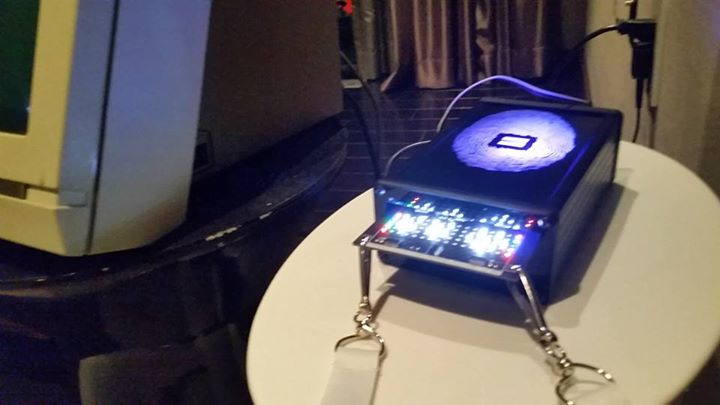

# 2014 Queercon 11 - DEF CON 22 Badge

Sequel to the QC10 badge, the QC11 badge incorporates various features of the former circuit, with some more advanced features.  One of the big complaints about the 1st badge was people not really knowing what it was doing or why.  This is how we figured out people don’t read the info they’re given. 😉  From this we decided we wanted a display of some sort, but more about that later.

The QC11 badge ended up being designed to look exactly like a 3.5” floppy disk, including a “dust cover” executed using soldermask resist.  It included a custom designed and built 80 LED, 5 x 16 matrix display, 915 MHz radio, and an IR transceiver.  The IR and RF communications enable short and long range badge to badge communication, respectively, and the display shows interactions between the badge and the outside world in a whimsical way.  The long range communication was used to identify the number of badges in the vicinity and transmit the clock.  The short range was used for badge “pairing” (or choose your euphemism), which allowed a user’s stick figure to “visit” the paired badge.  The badge also kept track of the time, date, and if you’ve been attending events.

Fun fact: The time and date are transmitted via the radio, but not retained upon power cycle.  Throughout the con, we set exactly one badge with the correct time and date.  After that first one, the clock was transmitted badge to badge so successfully we never needed to manually set another.  Nifty!

The badge was a huge success and was in extremely high demand at the conference.

One of the organizers posted a really good write up over on the [main Queercon site](https://web.archive.org/web/20140818132249/http://www.queercon.org/queercon-badge/queercon-11-readme/), explaining a lot of the software features and their interaction with the hardware.

## Challenges

We knew we wanted to expand on the LEDs of last year and we were pretty sure we wanted to do a display.  The original concept was for a stacked design where 7-segment displays were on the bottom board and were visible via a cutout in the top board.  This idea ended up getting scrapped mostly because SEVEN SEGMENT DISPLAYS ARE EXPENSIVE!  I had no idea.  Even in quantity they were way beyond our budget if we wanted this badge to have any features.  So we eventually landed on a custom build LED display using individual LED drivers for each LED.  I realize this was not the most cost effective choice but it was the lowest risk choice.

Another big challenge we faced was production costs!  For QC10 we went with an Colorado based turnkey service that was absolutely amazing, but at the very top of our budget range.  When quoted for QC11 that same company quoted twice our budget per badge, assembled.  As a result we ended up with a Chinese based fab and that… didn’t go well.  For QC10 we had a 3% failure rate on badges with 100% being recoverable.  For QC11 we have a 75% failure/ rework rate with about 90% of the badges being recoverable.  This was a huge blow, as we had to rework them by hand as we did not have time to rework them in China.

Lastly, we had a minor hickup with the IR modules.  Uber badge holders received their badges early and we noticed that the IR modules kept flying off!  Of the 12 Uber badges passed out two didn’t have their IR modules knocked off in the first day.  Solution?  Emergency trip to Fry’s for superglue gel.  We smeared it on all of the IR modules where they attached to the board and BAM!  We only lost one more unit!  Very cool!

## Lessons Learned

* Order critical parts early
* Leave time for rework
* Field test new parts
* Protect, reinfornce, or have additional spares of weak components

# Press

In the aftermath of the QC11 badge we got some really cool press!  Luna Lindsey posted [a really cool write up of Defcon 22](http://www.lunalindsey.com/2014/08/defcon-22-con-that-keeps-on-giving.html), which included some kind words about QC11.  This includes the quote:

> “It’s a beautiful and sophisticated badge and I will treasure it and bring it to future DEFCONs.” -Luna

So that’s pretty great!  Additionally we were approached by the organizer of the Counterfeit badge contest to be a last minute entry to the contect, booting out one of the old Defcon badges in favor of ours!  At the time of writing, the Defcon fourms are having some issues, but you should be able to find entries [here](https://forum.defcon.org/defcon/past-defcon-content/forum-archives/defcon-22-forum-archive/dc22-official-unofficial-parties-social-gatherings-events-contests/dc22-official-and-unofficial-contests/counterfeit-badge-contest/15167-dc22-counterfeit-badge-contest-winners) and winners [here](https://forum.defcon.org/defcon/past-defcon-content/forum-archives/defcon-22-forum-archive/dc22-official-unofficial-parties-social-gatherings-events-contests/dc22-official-and-unofficial-contests/counterfeit-badge-contest/15167-dc22-counterfeit-badge-contest-winners).

Last but certainly not least we got a write up by [Eric Evennchick in Hackaday](http://hackaday.com/2014/09/15/the-queercon-11-badge/)!  He fudged a couple of details here and there, which is totally our fault, but great write-up anyway!  (Aside from the fist comment, don’t read the comments.  It just devolves into an argument about if Queercon should exist.)  Also this comment by “Mike”:

> “The badge was awesome, it’s the second year running they’ve had badges that effectively reward socializing, whilst still allowing for hardware hacking for those that know how, which is exactly what a badge at a conference like Defcon should do! This year’s Defcon badges tried to do that a little (they had patterns and the goon badges could control the human badges), but nowhere near as fun or pleasing as the little stick figures waving to each other this year! Last year I didn’t know how they could top the badge, but they did. This year, I still don’t know, but I’m looking forward to finding out!” -Mike

