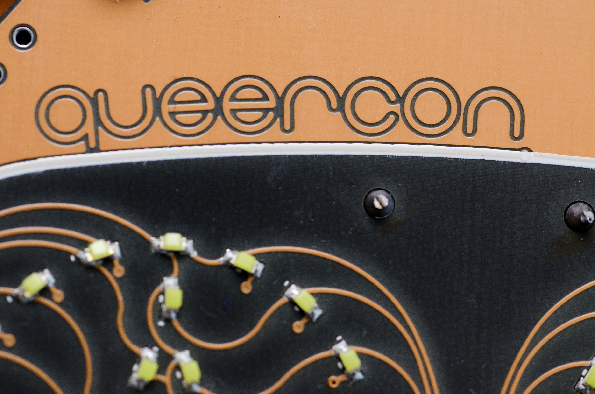

# 2016 Queercon 13 - DEF CON 24

For Queercon 2016 we decided to de-escalate our display arms race and go for something different.  We liked the cutesy, pet-like connection from the QC12 badge but also somewhat missed the outright bling and explicit pairing that we had in QC11.  We also wanted to make something different in our continuing quest to make badges like no one has ever seen before.

From these ideas, the Blooper gradually came into existence, and we’re quite proud of it!

Front             |  Back
:-------------------------:|:-------------------------:
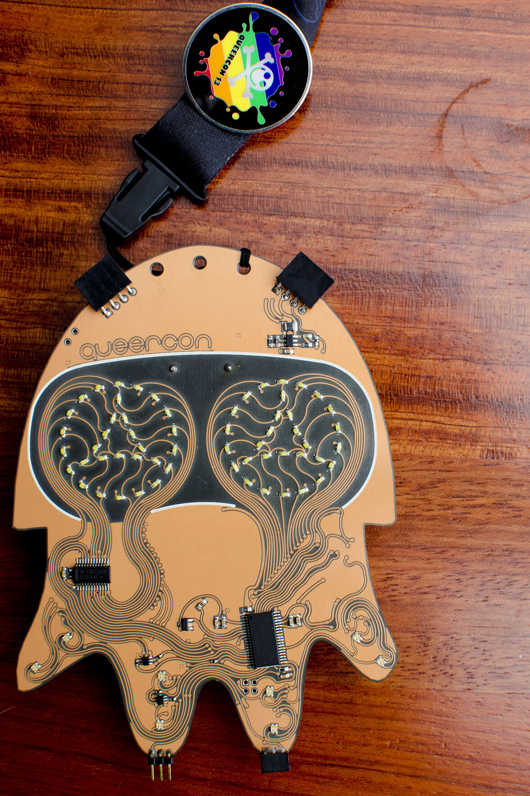  |  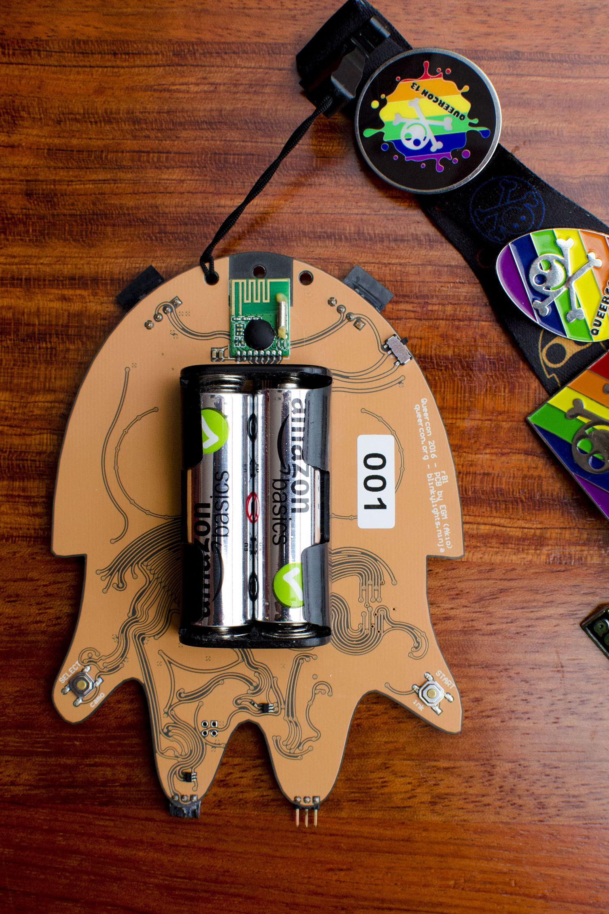

## What is going on here?

It occurs to me this write-up didn’t initially address the most striking feature of the badge: the way it looks.  So here we are.

As many have noticed, this badge has two unusual aesthetic features: curvy traces and a strange orange color.  The former is pretty easy to explain.  We’ve always done intricate and well thought out traces, so this year we really wanted to go for the gold on that, so to speak.  90% of the traces are arc segments or edge defined arcs.  This is discussed a little more later on, but tl;dr is it is a total pain in the ass.

The second unusual feature is the color.  Almost all PCBs are colored by something called the “soldermask”.  This serves to electrically insulate and protect the delicate traces of the board.  Soldermask is usually green… for some reason. Most electronic badges, including Queercon, opt for a different colored soldermask at a small upcharge in fab because they look cooler.  This year we decided to get weird and go for clear soldermask.  This is not to be confused with no soldermask, which is also an option.  The soldermask is still there and is what gives the badge that matte finish.  This also means that the orange color you’re seeing isn’t any special coloring, it is the copper of the board laid (figuratively) bare.  Additionally, most boards are made from a beigey fiberglass material called FR4.  Ours is too, but we opted for black FR4, which, as the name implies, is just normal FR4…. but black.  Hence the crazy contrast and color combo we’ve ended up with.

## Hardware Design

For those familiar with our past designs, the hardware on this one is going to look pretty familiar.  We opted for the same MSP430 with FRAM as last year, primarily for code portability reasons.  Also this chip is very full featured and easy to work with.  We did eliminate the external oscillator this year to reduce cost.

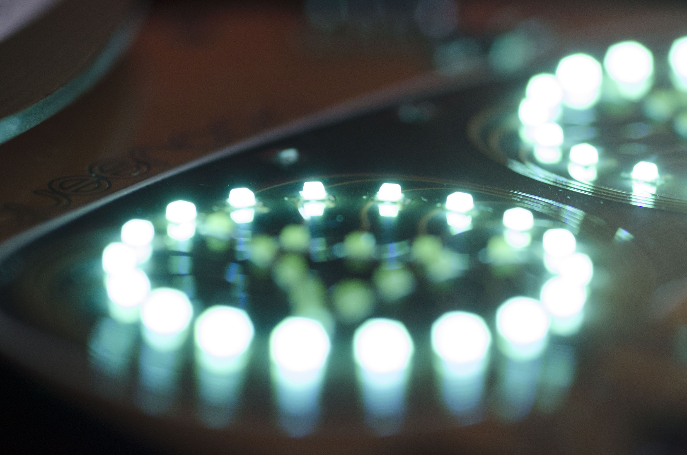

The LED controller is also the same as last year, but, as per the Queercon usual, we wanted to go with lots of LEDs.  For QC11, we’d used LED drivers for every led.  This was inefficient, but low risk, easy to control, and not all that expensive.  This year, however, we decided to go with a more “traditional” single LED controller with FETs to switch between banks of LEDs.  This way we get all the features of a high end controller, but without all of cost of having to place 6 of them.  This created a bit of a learning curve, but ended up working just fine and saved a lot of space on the badge.  Additionally, our fab house isn’t know for being exceptionally good at LEDs, so a lot of hand holding was involved to get these together.

The single color LEDs themselves are actually what we had speced for QC11, but ended up not being able to order as many as we needed at the time of fab.  This year, we brought them back out because (A) we think they look super cool and (B) they are, you guessed it, exceptionally inexpensive.  That said, I really dig the cool aqua color, even if it doesn’t really “go” with the badge.  There are thirty single color LEDs in each eye, with each LED being individually addressable.

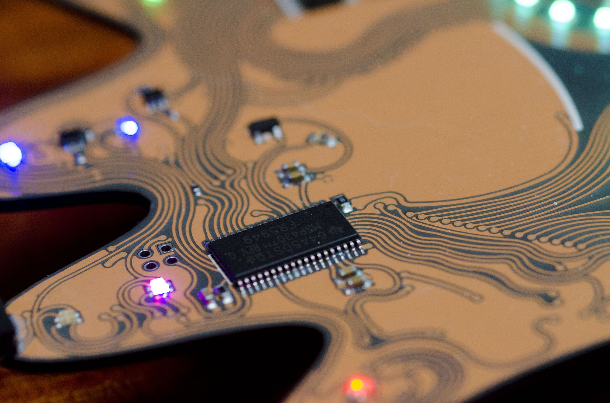 

The RGB LEDs aren’t anything particularly special, but seemed to be a big hit.  They put out a lot of light in a small package, were very inexpensive, and pretty durable.  There are eight per badge, with two per tentacle with each element being individually addressable.

This year we did change the RF module from a RFM69CW at 915MHz to a RFM75 running at 2.4GHz.  This was done to reduce cost, saving about $3 per badge, decrease BOM count, and (hopefully) increase range.  The RFM75 isn’t as full featured as previous modules, but it comes with an integrated antenna and is exceptionally inexpensive.  Our cost was $0.70 per module shipped.

## Interaction and Software

The badge has several ways of interacting with the outside world: Eye expressions, RGB tentacles, the “hat” expansion port, the mating ports, and a 2.4GHz RF module.  Each of these works in concert to make the badge feel as alive as possible.

When the user first powers up the badge, they only have one color pattern to the LEDs, called a “camo”.  To earn more the user must interact with people, other badges, and Queercon itself.  For example, the rainbow camo was only available for those that attended the pool party.  The trans, bisexual, bear, and leather camos were only available after having been “inked” by them.  Uber badges started out with these camos and could spread them at will.  The list goes on, but overall there were twenty-one camos available by the end of Defcon.

So what does one do with these camos?  Well, for one, it makes the badge pretty!  The user can change them at will using one of the two buttons on the back of the badge to express their orientation/ interest or just pick one that is pretty.  Whatever feels right.  The user can then spray this camo out, a process called inking, to the other badges in range.  This causes them to temporarily show that person’s camo rather than their own, as well as have to close their eyes.  Also makes them a bit grouchy and the ink originator a bit happy.  I swear that makes sense if you’ve seen it in action.

Since eyes have been mentioned, lets talk about them!  The eyes are used to make the badge express whatever it is feeling at the moment, in addition to how many other badges it sees around it.  The more badges it sees, the faster it blinks.  Simple, but here we are.  Other emotions such as anger, sadness, and happy are mostly random, as is having the badge look around and make funny faces.  The badge will look happy any time it is mating or inking (we call that the “giggity” face) and become angry if it is on the receiving end of an inking.

In addition to all the LED stuff, the badge has mating ports at the bottom.  These little buggers turned out to be quite fragile, but more on that later.  When two badges are connected at the tentacles they mate and each badge gets credit for the mating, and the badge gets VERY happy.  In addition to the mating, if both badges are on the same camo they can do a “super ink” which allows an inking to propagate much further than a normal one.  We are stronger together after all.

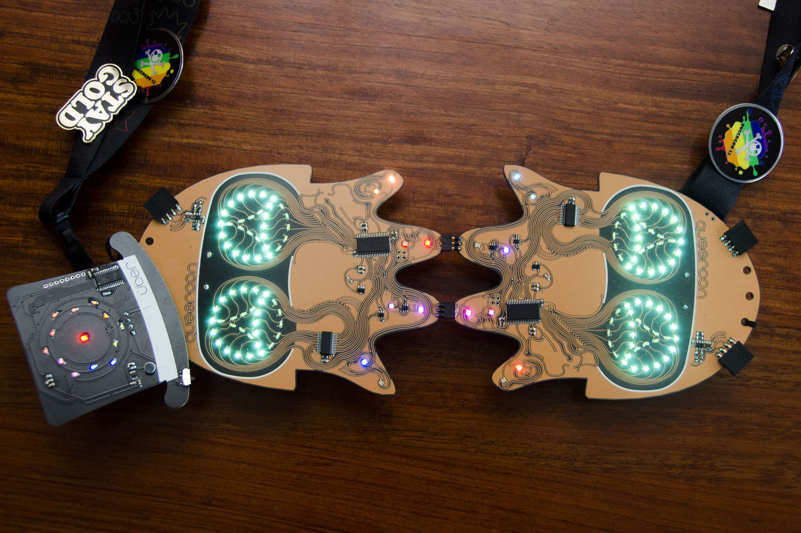

We intended to have a station that showed all of these stats and also dispensed human hats, but it broke in transit, a mistake was made during repair, and all of the magic smoke was let out.

## Hats!

In the past, we’ve used soldermask and features to differentiate Uber badges from “normal” badges.  However, given the clear soldermask is core to the look we couldn’t go down that route.  That is where the idea of “hats” came in.

Ubers get a special matte black top hat to adorn their badge at a jaunty angle to signify them as Uber.  Similarly, handlers got a special hat that made them always look angry and get the special handler cop lights camo.  Human had distribution was basically super broken due to the aforementioned broken station, so they were handed out to people who did cool things with their badges, or were nice to us.  Whatever.

The Uber hats may look pretty familiar to most.  That is because they are a close replica of the QC10 badge, complete with wireless module, antenna, and microphone.  We added a power switch and a “party mode” button, but otherwise they’re basically identical.

The Handler hats are a little different.  They’re simply a 555 timer driving a counter chip to spin some LEDs.  Simple, easy, and adorable.  The user has two adjustments they can make: rate and brightness, made by two pots on the boards.

Human hats were supposed to be a special give out for getting various badge achievements.  They don’t actually do anything, but they do provide a breakout for the power and ground from the badge and provide space for the user to place their own electronics.  Use at your own risk!

In addition to the pre-made hats, we had quite a few user made hats.  The spec for the hat port was “leaked” a few weeks before the con to allow people to make their own accessories.  People like it so much we’re almost going to have to do it again soon!

## Support Boards

In addition to the three hat designs, we ended up with a wide array of additional support boards.

The base station boards were just a rip off of last year’s base station boards, but fitted with a different radio.  These boards provided event check in functionality, and a few extra things.  Nothing too special, but yet another BOM that needed to be managed.

The tether board provided a mating interface for a special “base station,” which allowed users to check their badge’s stats and achievements.  It was a simple pass-through/ breakout board with a couple of LEDs to indicate status.  The special station itself is powered by a Raspberry Pi 3 and a receipt printer.  The receipt printer was the thing that broke, which was annoying and surprisingly difficult to source same-day.

Like last year, we also had a preliminary dev board to try out the eyes and switching routines.  Also like last year, these weren’t terribly functional as they were a very early prototype.  They did, however, give me a taste for how awful routing that board was going to be.

## Design Challenges

In order to capitalize on a steampunk/ cyberpunk look, we decided to go with clear soldermask and “natural” traces.  This presented two problems.  The first problem is we had no good frame of reference for what this was going to look like. Image searching gets us part of the way, but as far as we can tell this isn’t “normal” in any way.  This is both a good thing, and a terrifying unknown.

The second problem is “natural” traces are a complete pain to create.  The PCB design software we use has interactive routing and active DRC when routing with “normal” traces.  Not so with “natural” traces.  Those are actually edge defined arcs, carefully sculpted and planned to look great and also be functional.  It was ruinously time consuming, but very fulfilling.

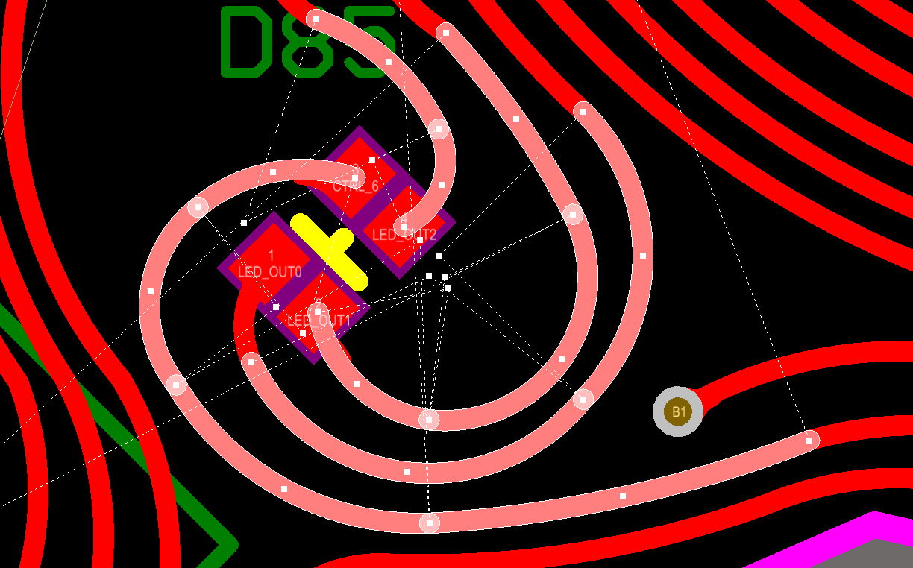

In our never-ending quest for battery life, we had a realization.  When trying to decide between two or three batteries, it was discovered that switching to three would actually reduce the overall capacity.  This is because with two batteries the voltage varies between 3.2VDC and 1.9VDC.  With that range, a boost regulator can be used to reach our desired 3.3VDC.  However, with three batteries, you voltage range is more like 4.8VDC to 2.85VDC, which is out of range for a boost regulator.  If using an LDO, even the best requires at least 0.1VDC difference between the input and the output, meaning about half of the batteries capacity, that below around 1.2VDC/cell, cannot be utilized.  The boost regulator, however, is good to 0.5VDC, or around 0.25VDC/cell.  At this voltage the batteries are all but guaranteed to be exhausted when the regulator drops out, leading to almost 100% capacity utilization.  Neat!

One of the biggest challenges facing me this year was the number of board designs we were dealing with.  Including the main badge, we had seven boards designed for this year.  That is a lot of design files and BOMs to keep track of.  Also, while I am usually sitting around taking a break between sending the board to fab and Defcon, this year I was still designing up until a week before the con.  Yes.  I am whining.

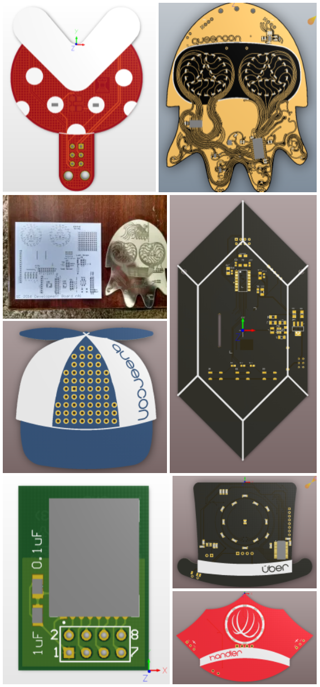

## Fabrication Issues

As with QC11’s badge, this year’s had a LOT of LEDs.  Unfortunately, this once again proved to be more than out fab house could handle.  This year, however, they failed much more spectacularly than usual and also saved themselves.

Long story short, as they were doing spot checks prior to shipping, they noticed some backwards LEDs.  This isn’t unexpected, except all of these boards were assembled with a pick and place machine, which means if one board is wrong, likely they all are.

Code Brown.

Turns out one of their engineers decided our pick-and-place files were incorrect and modified them without any interaction with us (the customer) or their head office.  We never got confirmation, but we suspect this caused a number of LEDs to be incorrect on 100% of the boards.

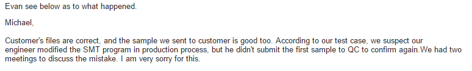

We overnighted them a programmer and test code, the same programmer and test code they said they didn’t want two months ago, and they used that to flash test code into the badges and rework them as needed.  After they got the tester, the badges were out the door in a day and in our hands the next.

When the dust settled and we all changed our underpants, we ended up with a 1.2% failure rate with 100% of the badges being re-workable.  This is our best outcome since moving to offshore manufacturing!

## Field Failures

The tl;dr is the female headers broke a lot, and we had quite a few LEDs broken off, plus some switches.  Also two badges managed to corrupt their firmware, which is impressive.

The switches are a bit of a no-brainer.  They extend past the body of the badge and were only soldered on in two places.  They were also $0.17 each so I didn’t expect much.  Luckily most people figured out they could fix them with binder clips or bridging the pads!

The female headers were disappointing, but not surprising.  We ended up with using 2.00mm female headers for the making ports, rather than the more common and robust 2.54mm, for two reasons: cost and compatibility.  We knew we were going to buy more of the female hat ports than female mating ports, exactly twice as many in fact, but we also decided the mating and hat ports shouldn’t be the same pitch.  The latter was because we knew if they were, people would try sticking them together and end up frying something.  Yes, these are all excuses.  We learn as we go.

The sheared LEDs caught us by surprise, for sure.  The QC11 badge had more exposed LEDs on the face and we suffered fewer failures.  We’re thinking the reason for this is that on the QC11 badge, the more robust controller ICs acted as a buffer between the two, preventing swinging badges from damaging their precious QC badges.  Either that or people were more careful.  Take your pick.  Either way, we’re unsure we can or will do anything about this in the future, but LED damage will certainly be kept in mind regardless.

## Press and Twitter Love

We got so much awesome twitter love this year it is going to take me a while to find it all.  Always happy when people like our stuff!

Eric Evanchick at Hack-a-Day [posted a great write up](http://hackaday.com/2016/08/10/what-we-learned-from-the-2016-queercon-badge/) which included some unique insight about the evolution and continuous improvement we’ve been doing over the years.  I’m happy to say he also scored a badge this year!

[We also got a write up in Engadget](https://www.engadget.com/2016/08/13/def-con-2016-badges/), which might need to be on my tombstone, by the well spoken Roberto Baldwin.  His article is about all of the badges, but features the Queercon 2016 badge plus a bunch of my photos from here.  My quotes sound a little harsher than I’d like, I have nothing but respect and admiration for my fellow badge makers, but that cool.

Queercon, including the badges, was also featured in [Gay Vegas](https://issuu.com/gayvegas/docs/gayvegasmagazine2016sept/6).  Pretty exciting!  One again my “press photos” made an appearance.  I really like that table…

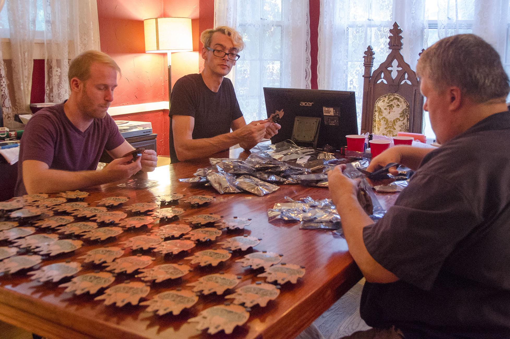

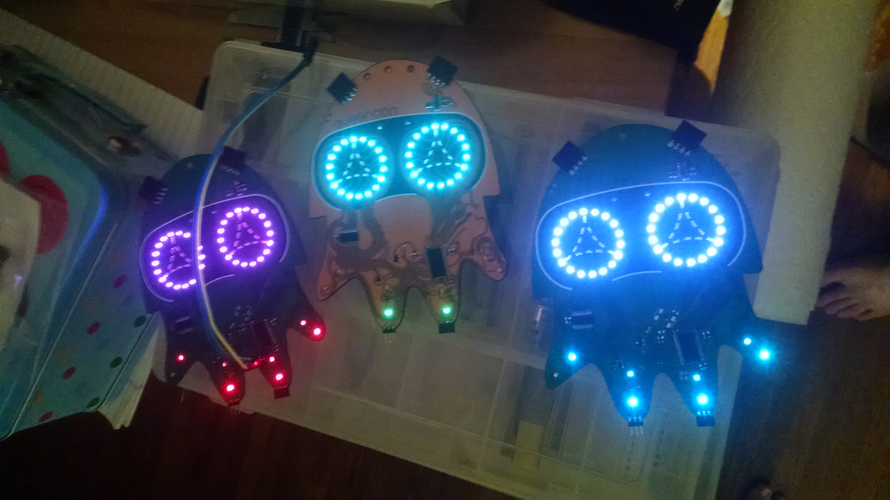
