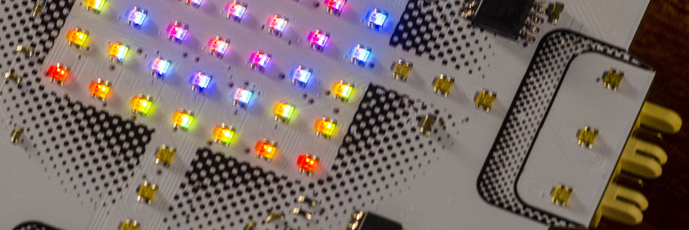
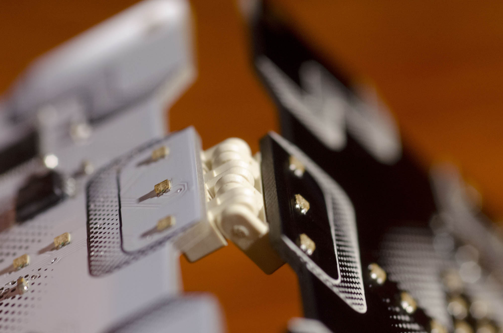
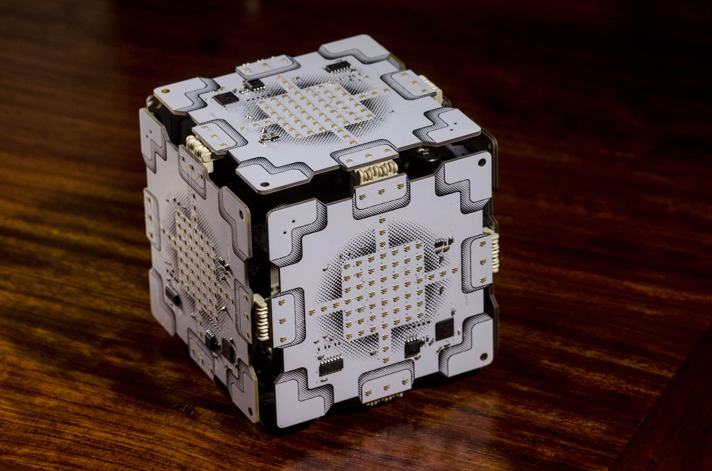
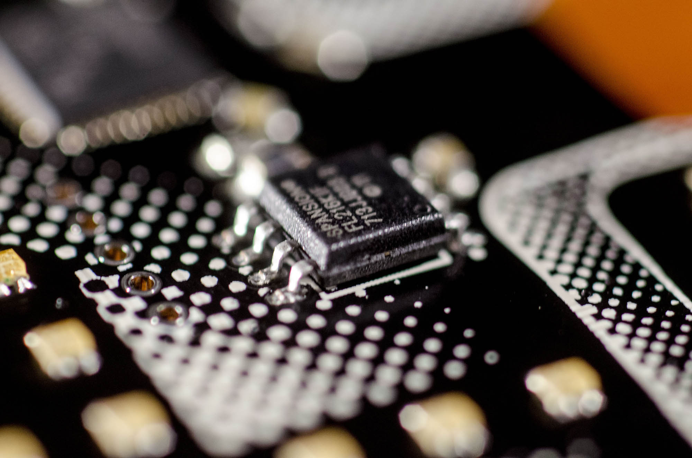
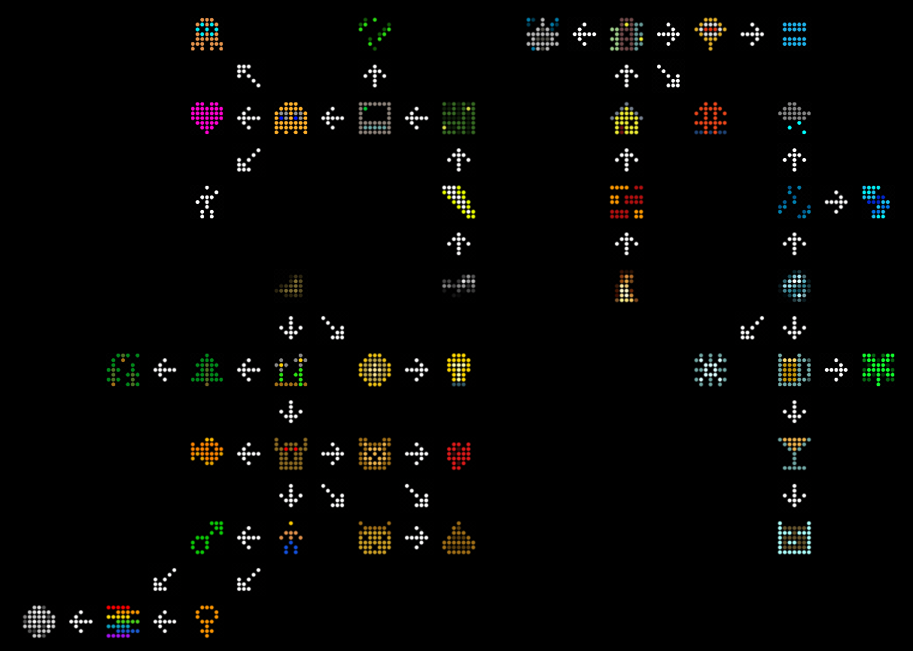
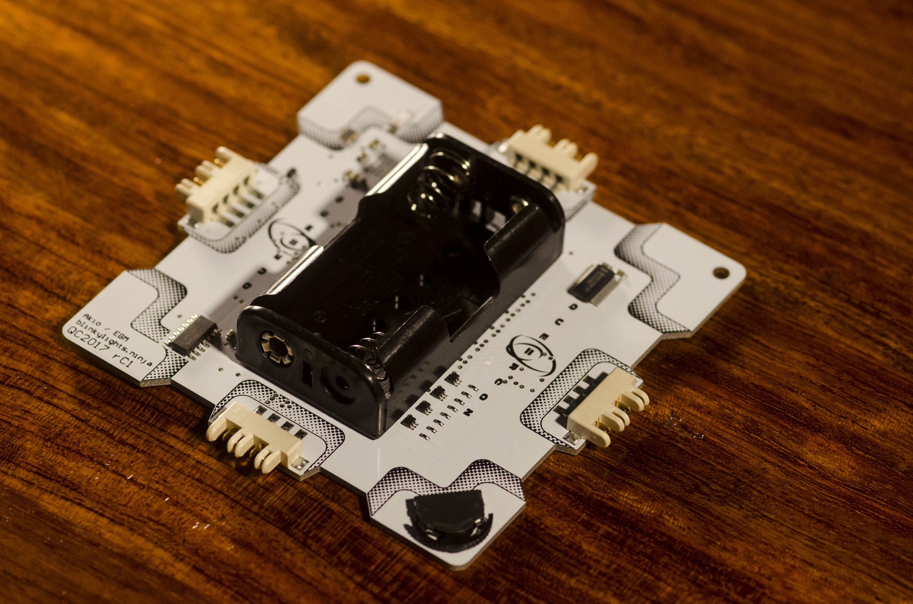
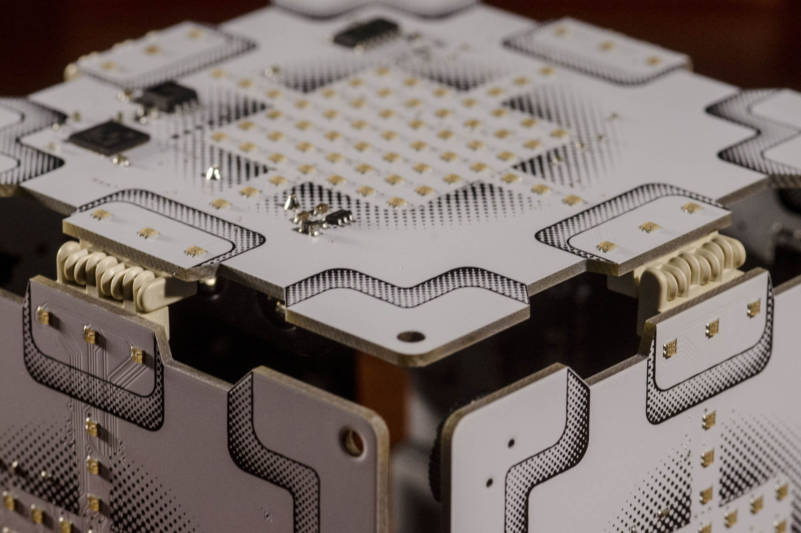

# 2017 Queercon 14 - DEF CON 25

2017 was a year of significant numbers.  The fifth Queercon badge, the twenty-fifth DEFCON, zero official electronic badges and many, many “elite” electronic badges, as many as 5,000 total by some estimates.

The QC2017 badge had a more difficult design year this year too.  After the success of Blooper in 2016 we weren’t quite sure where to go next.  We came up with a pretty neat concept, but by mid-January still hadn’t started on actual electrical design, pending conceptual design by the graphics team.  As time wore on it started to look like a 2017 badge was in danger of not happening at all.  As a result, we decided to bail on the ambitious design and go to a “failsafe” design I’d been working on.  The idea was we’d go with known hardware and controllers to reduce development time and risk.

That lasted almost a week!

Somehow, despite the urgency, we managed to change the processor, radio, and LED controller, argue about the design, and generally spend a lot of time we didn’t have on things we’d agreed to not argue about.

Nothing worth doing is easy and in the end, we ended up with one of our best badges yet.

## Design

The “failsafe” design was meant to be exactly what we like to see at Queercon: lots of blinky LEDs with some cool connectivity and interoperability.  The original concept was to utilize parts already in the bin to minimize risk and development time.  We had the LEDs from Blooper which were inexpensive, bright, and pretty easy on power.  We had also toyed with the use of rotoconnect board-to-board connectors for a several years, but due to size and cost they’d never made it into a design.

Combining those two elements into a design, an idea was hatched.  Let’s make a badge that can connect to more than one peer at a time and has an expensive looking, vibrant RGB LED display.  What will it do?  Doesn’t matter!  Stuff!

In case you’ve been under a rock for the last ten years, visually, we borrowed a bit from “Portal,” specifically the weighted storage cube/ companion cube.  This allowed to us some nerd cred and a visual theme that permeated most of the other materials in the con.

## Hardware

!(close up of LEDs](media/qc20170035.jpg)

### LEDs

The LEDs are a simple 20mA per channel, 0604 packaged RGB LED sourced directly from China.  We’d used a similar LED last year, last year’s now EOL, and decided to scale up due to the low cost per unit, ~$0.026 each.  Good thing too, because we used a lot of them, 73 in total.  We had 49 in the 7×7 LED matrix display and an additional 6 per side to indicate pairing possibilities and status.

### Connector

The other major hardware feature was the edge connectors, again, mentioned above.  Two things make these really stand out: their genderless mating and their range of motion.  The first is unusual, but fairly self-explanatory.  Essentially they’re only sold with even numbers of pins and those pins effectively alternate between male and female.  When a connector is presented with another, they mate because of this alternating pattern.  It is very nifty.  The range of motion is a product of the construction, but it allows almost 180 degrees of rotation while maintaining electrical connectivity.  This allowed us to get to our party piece…

The Cube.

We weren’t sure how long it would take people to figure it out, and how they would react. Ultimately, we saw more large fabrics than we did cubes and, weirdly, no advanced shapes.

Unfortunately, due to a software glitch (one of the few!) creating the cube and ensuring good communication between all six badges (twelve connections) did not produce any result other than looking completely awesome.  Truth be told, the only effect was supposed to be a third heart animation, but we think, in retrospect, two is plenty.

### CPU

All this connecting fun is facilitated by our new processor, a TI CC2640, which is a 32-bit ARM Cortex M3 based processor with BLE built in.  One of the cool features of this processor was the ability to route any of the internal UART connections to virtually any set of output pins.  In this way, we were able to create four serial ports out of one, essentially.  This did create a complications however.  Because one serial connection is shared across four devices, if two connections are made to the badge, but not resolved, they need to be resolved sequentially.  Additionally, if a connection gets hung up or fails to time out, the other ports can’t resolve properly.  Luckily, this was little more than a minor annoyance during the con.  The pin flexibility of the processor also allowed the routing to be a lot cleaner.  Essentially I brought all connections to the processor and then rearranged the pinout so they could be brought directly in without having to rearrange traces.

### LED Driver

The LED driver was the same unit seen in previous years.  We did originally spec a low-cost Chinese clone, but difficulties in communicating with the device and some eccentricities in addressing it meant we scrapped it for the tried, true, and legitimate TI part.  This 16 channel LED controller was paired with 2 shift registers and 15 FETs to control the LED commons, enabling us to individually address all 219 LED channels.  We did discover that despite having a reasonably fast processor, this was pretty much the limit for us on LED controllability with a single controller.  After we exceeded a scan rate of about 2kHz, the processor began to perform erratically.  George took this to mean we’d pretty well reached the limit of what we could do, and scaled back a bit.  This gave us pretty good performance, excellent battery life, and a little bit of PWM/ scanning flicker.  Shockingly, no one at the con said anything about the latter, so I think we call it a win.

### Power

Speaking of battery life, shout out to Skyworks!  We’ve been using their excellent little boost regulator for several years now and this year it really killed it.  Most attendees made it the entire con without changing batteries or only having to change them on Sunday.  Impressive considering all 219 channels on simultaneously at max current would draw 4380mA, which, luckily, wasn’t possible with our setup.  Still, at max brightness we could be pulling as much as 900mA! We’ve come a long way from QC10!

Aside from the compressed timeline, this year was pretty breezy from a design standpoint.  The largest challenge I faced was the sheer quantity of LEDs.  I know I say that every year, but every year we increase the complexity by a significant margin.  No really!  Here is a table!

| Year           | LEDs | Elements | Controllers |
|----------------|------|----------|-------------|
| QC10           | 13   | 16       | 1           |
| QC11           | 80   | 80       | 5           |
| QC12 (display) | 5    | 15       | 1           |
| QC13           | 68   | 84       | 1           |
| QC14           | 73   | 219      | 1           |

Anyway, to make the board routable, some cleverness (I think) was required.  Essentially the components were arranged such that the “color” control lines could run across the rows of the main matrix.  This worked for the first 7×5, though the bottom 7×2 had to be arranged such that all control lines could easily escape to where they could hit vias.  The remaining “edge” LEDs were picked assigned to control lines and shift registers as was convenient for routing.  If you look at the schematic vs the reference designators, you’ll probably notice it is a shit-mess and that is why.

In the end the board was routed and after George built his translation matrix in software, all was well.  Well enough anyway...

## Interaction and Software

This year was unusual in that I had almost no idea what the badges were going to do until I actually got to the conference.  This was due to a healthy mix of burnout and having other shit to do.  This is all to say that if this write up doesn’t sound quite right… that is why.

The brain-child of our UI/UX/graphics designer, Jonathan, the primary user interaction for QC2017 was loosely based on a game called “Alchemy”.  The idea is users are given a set of basic elements (air, fire, water, earth) and are set to combine them into more complicated elements.  For example, water plus fire made beer.  Yes, beer is an element. Don't fight it.

Players are only allowed to have five elements at a time, so every time a new one is made, the old combined element is replaced.  This required a lot of user interaction as a total of seven badges are required to complete the game.

Ten special badges contained a fifth basic element: coffee.  That is because this year Starbucks was a huge contributor to Queercon.  Oddly enough, rather than having their logo plastered all over our actual design, they were more in favor of doing something that would facilitate interaction with their members.  This came in the form of a required element that only Starbucks people had.  No reports yet on how well it worked, but I am hoping well because they were great to work with and we’d love to have them back.

Aside from the game, we brought back “flag” or “bling” mode, wherein the user can select a specific color pattern to represent themselves and the badge will display that instead of their current element.  The usual array of options were available.  Additionally, if two badges in this mode connect, the pattern propagates through the connected badges, giving the look of all of the badges being one, large display.

## Field Failures and Yield

Yield from the fab was good, with about a 0.7% failure rate.  By far our best yet.

Failures in the field were few and far between as well.  We had one gentleman rip off a connector, but he successfully re-soldered it himself.  We had at least three reports of “IDKWH!” (I don’t know what happened!) failures, which were universally “I might have accidentally spilled something on the badge” failures.  Luckily a little flux off and these came back.

We did, however, have a rash of failed CPUs.  We assume ESD, but have no way of confirming.  For us, this pretty much kills QFN and BGA parts for us, as field rework on the fine pitch QFN CPU was a too fiddly to be done half-drunk (or fully, whatever) in a dimly lit hotel room.

One unexpected field problem was due to some hardware I wasn’t expecting to have a problem with: the user.  While in previous years the badge connection (“mating”) was mostly consensual, this year we heard reports of people being a little too aggressive and impersonal in pursuit of completing the game.  While we enjoyed that people we really getting in to the game, we were bummed to hear that the facilitation of social interaction devolved into taking what they wanted.  This will be considered on future designs.

Another unexpected failure was quantity.  For QC13 we produced 250 badges and felt the number was basically perfect.  Knowing we’d have some growth for QC14, we produced 275 badges, plus 10 sponsor badges, expecting that to continue to give us the right mix of rarity and achievability.  What we didn’t expect was Queercon to experience essentially explosive growth.  We’re guessing around 200% for our main parties and at least 75% for mixers.  This unexpected growth meant a lot of people didn’t end up with badges, and that is a massive disappointment.  We will do what we can to compensate for 2018.

But, again, the hardware failures were rare, unlike last year, and overall we’re very pleased.

## Conclusion

Overall, I am very pleased with how everything turned out.  The game was engaging, the bling was blingy, and I didn’t spend the entire con in front of a soldering iron.  We’ve learned some valuable lessons and have a ton of ideas on how to grow some new concepts for interaction next year.

Too bad Defcon is cancelled.

