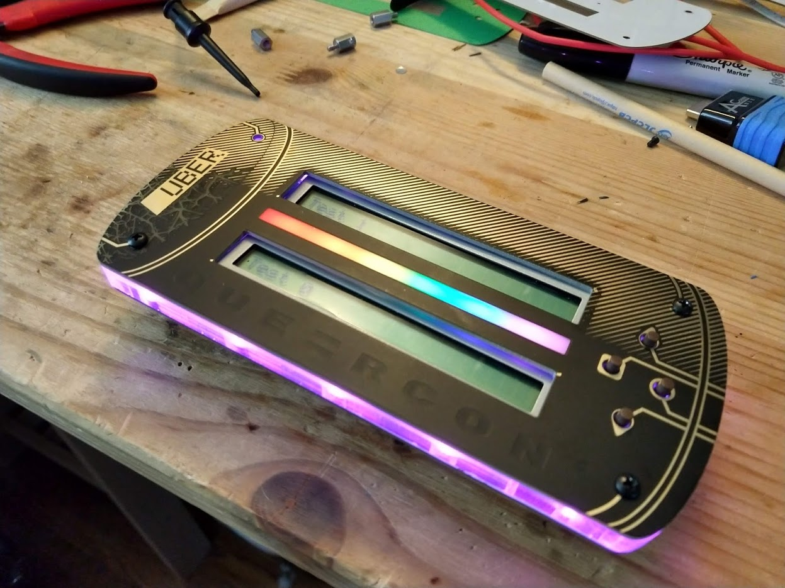
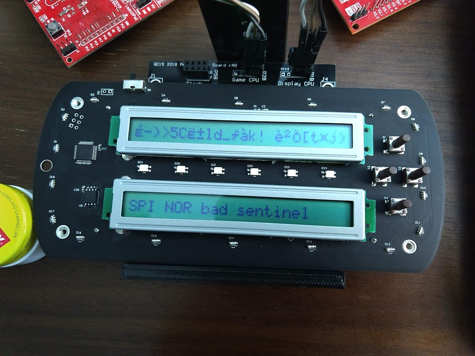
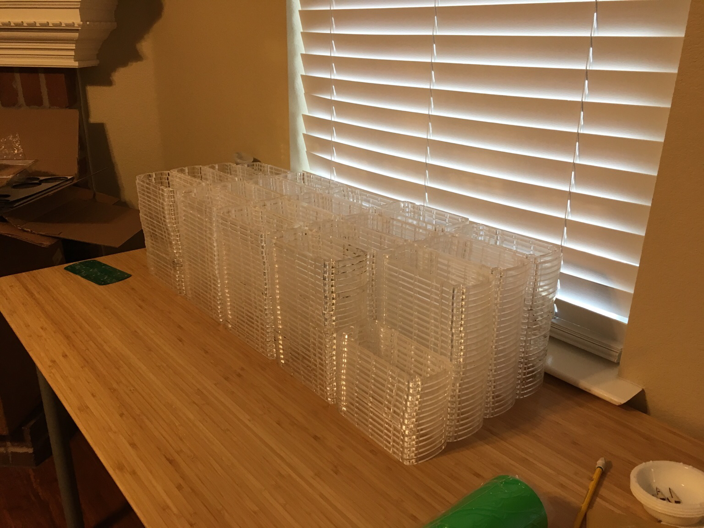
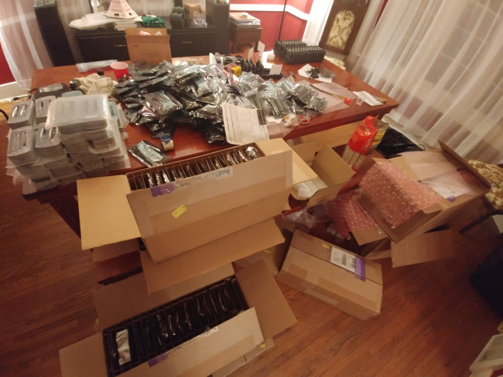
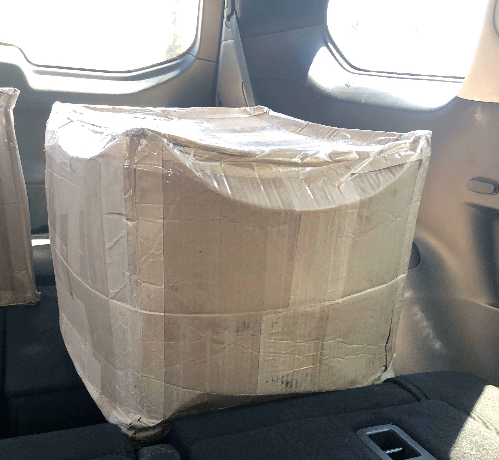

# 2018 Queercon 15 - DEF CON 26

The Queercon 15 badge is the largest, heaviest, and most complex badge we’ve ever created.  It is also, by far, the highest production number badge we’ve done, with nearly double the units produced compared to the previous year.  This year was also the first year of the non-electronic Queercon badge, but more on that later.

## How did we get here?

This year’s badge was mainly a quest to try stuff we’ve never tried before.

We’ve always been intrigued by vacuum fluorescent displays, but as it turns out those are pretty expensive and difficult to drive.  However, in the process of searching for cheap ones, we came across the Wintek WD-C2401P-1GNN on AllElectronics.  Being that the displays, at quantity, can be had for $0.20, needless to say we were intrigued.  That said, they weren’t exactly elegant…

At the same time, we were also contemplating utilizing the now plentiful and incredibly cheap short run PCB manufacturers.  When we started working on badges, three short run PCBs would cost you $100, only come in green, and take about a month to produce.  Over the years more and more short run PCB manufacturers have been cropping up and as the price and lead times dropped the production options only seemed to expand.

I say all that to say those two ideas paired together led us to where we are now.  Active bottom board, passive top boards with various different designs, and something cool in the middle.

## Bottom Boards and Hardware

Naturally the centerpiece of the design is the displays.  These are weird little buggers that we found accidentally when shopping around for possibilities.  They’re pretty simple 1×24 character displays that take 8-pin parallel commands, for some reason, and are decidedly retro.  Data on them is pretty scarce outside of the datasheet, whose only date code appears to have been when it was scanned in in 2000.  We had PDFs back then, so I’m going to guess they’re much older.

The rest of the badge is our usual suite of TI processors, expensive LED controllers, and bright, cheap RGB LEDs.  This year we opted for two processors, one to tend to the radio and game functions, and one to deal with the LEDs and displays.  The supervisory processor, a TI MSP430FR2422 was inexpensive and indispensable and I suspect we’ll be using those for years to come.

## Top Boards

As mentioned in the introduction, the top boards came about as a way to protect and mask the somewhat ugly display and also personalize badges.

Initially, we thought we would have tens, maybe even hundreds of different top board designs.  Crazy shapes, sizes, colors!  Personalized boards!  Wooooo!

However, in the end, we ended up with the designs you see before you.  This was mostly due to time, but also budget.  Shocking, I know.  Turns out creating hundreds of top board designs is rather time consuming and creating 90 runs of 5 boards, or whatever, gets rather spendy even with cheap PCB manufacturing.

In the end, the eight designs you see were all we ended up with.  Design credit goes to Aaron [(@mrtwinkletwink)](https://twitter.com/mrtwinkletwink) who we brought in when it was pretty clear we were fucking this up and he was killing it.  Seriously, go have a look at this guy’s designs.  They’re phenomenal.  Happy to have him contribute and I would be shocked (and a bit disappointed) if this were the last time we utilized his talents on the Queercon badge.

The designs themselves were made using only normal PCB manufacturing processes.  In fact, he didn’t even use silkscreen!  I cannot swoon enough about these.

## Access Passes

We also did a very large run of top boards with lanyard holes, sometimes refereed to as “access passes”.  Due to the explosive growth Queercon has encountered over the last couple of years, we’ve made the sad but inevitable decision to make some of our events open to those with badges or passes only.  As a result, we did a large run of access passes to provide a inexpensive and more plentiful way to attend Queercon events without needed to score an electronic badge.

In our postmortem it was indicated that while these were “better than nothing” the passes created a second class of attendee, which is not what we’re going for and we will look to address in the future.  If it were up to me everyone would get an electronic badge, but c’est la vie.

## Mid-Boards

Mid-boards were originally going to be standoffs, much like the Queercon 12 Tamagotchis, but ultimately we decided it would be even cooler to use cut acrylic as a standoff.  This was made much easier with the discovery of Keystone Electronics’ threaded, surface mount standoffs.  Like the rotoconnects of 2017, these were a game changer in terms of new possibilities, enabling us to mechanically connect things to our badges using screws without having to pay for extra processes or deal with additional hardware.

The actual acrylic cutting was done by Andrew (@Six_Volts) and his wife Ali using a Dallas maker space local to him.  He managed to cut all the required pieces out of just two sheets of acrylic.  The process was time-consuming and annoying, but we’re glad he did it.  He was even nice enough to drive them up from Dallas personally for our annual testing and assembly party.

## The Game

While I love all of my children (un)equally, we noticed a major flaw with the Queercon 2017 badge, the cube: I didn’t love it.  I loved the design and the execution, but it was a just a thing.  I realized this in the most mundane of ways: this was the first badge very few people took to group dinners.

To address this, we’d originally decided the badge needed a “face” and personality, but quickly decided that it didn’t need a face to have a personality.  Jonathon, our UI/UX and graphics guy, had been reading the Expeditionary Force Series, which apparently is about a snarky hyper-intelligent AI that had lost his memory.  He pitched the idea of making the badge a… snarky hyper-intelligent AI that had lost its memory.

Not saying it was our most creative moment.

In execution, the badge starts out counting down in hex.  Brilliantly, George, the software guy, had all the countdowns and LED animations sync across the radios.  No small feat considering our connectivity issues and almost complete lack of testing.  The end result was at the launch party all the badges were counting down to something.  No one knew what, but they were.

When zero hour came all the badges woke up and you’re personal quest to restore your AI began.  It was a really cool moment to see everyone stop conversation, look at their badges, and begin interacting with them…

Ok on second though it turned a successful party into what everyone things “millennials” are doing at a party.  Still, the badge staring didn’t last long and it was a cool moment to have it happen all at once.

After the intro sequence, in which the user is tasked with “waking up” the badge and getting it to speak English, the user is set on the quest of trying to decrypt a file that is distributed among the badges.  Basically, in typical Queercon fashion, the more badges yours connects with, the more it learns about “the file” and the more it can decrypt.

In the end (spoilers) the file was ASCII art of the original QC logo.  It’s about the journey.

Don’t forget to drink your Ovaltine.

## Production

This year we made the switch back to USA based assembly, though we kept the board fabrication overseas.  With all of the well documented quality and customer service issues we’ve had in previous years, we thought it was best to use a domestic assembler.

Overall we were really happy with the result.  The assembler was easy to work with and they inspired the confidence that was so lacking in the previous years.  We did have one major hiccup, without the mid and top boards to protect them, the 13mm tall buttons were getting damaged in shipping.  Luckily we caught this on an early shipment and the assembler was able to add additional packing to ensure the boards arrive undamaged.

All 10 boxes.

As previously mentioned, given the scarcity of badges last year, we decided to increase production this year to 450 electronic and over 900 non-electronic badges.  This led to a lot of problems we’d not experienced before now.  Like, for example, how to store, test, and ship ten boxes of PCBs.  Or how freaking heavy 1000+ 3×6.7″ un-assembled PCBs are.

In the end, the badges themselves, fully assembled, weighed just over 180 pounds and took up most of my house as a result.  The top boards brought the total shipping weight to 284 pounds.

UPS looooooved us.

We did not love them, as they managed to mangle 40 badges in shipping.

We've learned a lot about shipping and packaging since and because of this badge.

## Assembly and testing

Assembly and testing went mostly OK.  Given the volume of work and badges, we opted to do our annual assembly “party”, where I feed my friends pizza and beer in exchange for their help, over two weekends.

The first weekend where we tested the badge hardware, installed the mid and top boards went mostly well.

Except the radios didn’t work.  Hooray!

Long story short, we discovered that the radios didn’t appreciate having been put through a re-flow oven, which apparently caused their frequencies to drift, leaving us with approximately three distinct groups that couldn’t reliably communicate.  We’re not sure that is the cause.  Long term Queercon attendees might remember this problem with the Tamagotchi badges too, though those used a different radio by the same manufacturer.

Luckily George, with help from a different Andrew, devised a way for the badges to “self-calibrate” which seemed to bring about 90% of them in step.  Only time will tell how it ends up.

The second assembly party went really well.  All we needed to do was program the production code and calibrate the radios.  About 200 badges in we called a halt because a replacement program slave participant didn’t get the calibration memo.  He’d just started, so we proceeded to roll back the badges he’d programmed and check their calibration.  It was at this time we also realized a good number of these badges thought they were Badge #000, which they were not.

Another long story short, George discovered a race condition in the code that sometimes caused the badge to read it’s number of of flash before it was actually finished being programmed, thus causing it to think it was badge #000.

A complete re-check of all badges resulted in much swearing and reprogramming, but at least we caught the issue before they shipped.

In the end, all 450 badges were successfully recovered and shipped, making this only the second time we’ve had 100% yield!

Until UPS smashed a bunch of them.

## Field Performance

Overall we were pleased!  The majority of failures seen were either radio or flash chip issues, both of which we were expecting.  A few of the damaged badges we’d open up only to reveal an entire rum and coke inside (“I don’t know how that happened!” the owner would cry) so water retention was an interesting side effect of the multi-layer badge.

An unexpected failure was damaged to the inductors, L1 and L2, associated with the voltage regulators.  They were far enough inboard of the badge I though they’d be immune from damage, but on several badges they managed to fall apart.  I think this was a combination of poor placement and a low quality part.

Other failures were related to torquing of the display and damage to the switch.  All in all, not too bad.

Battery life was poorer than expected, but it was a thirsty badge.

## Reactions and Press

Overall I think people were pleased.  It didn’t seem to be as hot of a commodity (one of the first years I wasn’t offered a wad of cash for one) but overall people were happy to have them.

Mike Szczys over a Hackaday was [the first to do a write up](https://hackaday.com/2018/08/11/teardown-queercon-15-badge-and-the-game-hidden-within/), it dropping just a day after my own.  He also gave us one of my favorite compliments ever:

> The Queercon badge team’s ability to hit home runs is somewhat alarming.

I’m blushing.

That’s all we’ve got for now.  Motivation to really change it up next year I guess.

## Lessons Learned

Let me get this out of the way early: I consider the hardware, software, game, and execution of the QC2018 badge a success.  Everyone did their best and we pulled off our most ambitious badge to date.

That said, there were a lot of things we can and will learn from.  The major problems we’ve identified post Defcon are mostly related to the scale of production, but also to the design of the game itself.

### The Game

Starting with the elephant in the room, we made some mistakes in the execution of the game.  For one, the introduction sequence where you poke, prod, and mostly get frustrate at your badge was extremely well crafted, but too obtuse for most people.  A little play testing would have gone a long way here, but alas, as George says,

> “You go to Defcon with the badge you have.”

Similarly, the game display was meant to show badge holder’s stats as a fun FYI.  Unfortunately the execution didn’t work as well as we’d hoped.  Which is to say the display code was super broken for the first couple of days.  Also it only ended up with the “top” badges, which made it feel more like a scoreboard/ leaderboard and therefore a contest.  It was not a contest, but I can see why people felt that way.  In the end having the “winner” hard coded to be Skippy was a clever nod to the books (I guess?) but ended up just annoying people.

You go to Defcon with the badge you have...

Further, the middle of the “game” seemed a little lackluster compared to the intricacy of the intro, and there was no apparent endgame.  Flags and patterns were awarded seemingly at random, and overall the whole experience felt disjointed from the hardware.  Play-testing, again, is going to be key if we’re going to put the polish back on our badges for 2019.

You go to Defcon with the badge you have...

### Logistics

As mentioned above, we ended up shipping over 280 pounds of badge stuff to Las Vegas in nine boxes with a retail shipping cost of over $2,600.  That was… unexpected. (Thankfully we got a corporate discount from a friend.)

Further, 40 of the badges were damaged by UPS in shipping.  Luckily the problems were small and the number damaged could have been a lot worse, but it still gives one pause.

As badge and badge related product quantities increase, we’re going to need to start thinking about shipping and logistics earlier.

Anyone want to drive from Tulsa to Las Vegas next year...?

### The Hardware

Again, as we grow we realize there are some things that you can’t do the same way.  Hardware acquisition and shipping is one of them.  This is exacerbated as more and more suppliers and manufacturers switch to “LEAN” manufacturing, worldwide stock of a part can dry up in a day.  This is what happened to our flash chip, going from thousands in stock in May, to NLA in July.

Our best guess here is to acquire critical parts early and make sure to use common footprints such that alternatives are available if one part goes away.

### Non-Electronic Badges

Who could have guessed if you intentionally create a 2-tier system you would unintentionally create a 2-tier system!?  Ok, well it seems obvious now…

Some post-con feedback is that while the non-electronic badge holders were allowed into parties, they were often completely ignored by electronic badge holders looking to pair with people.  This is expressly counter to our goal of inclusiveness and encouraging iteration and was a completely unforeseen consequence of the non-electronic badges.

This will be remedied in the future.
