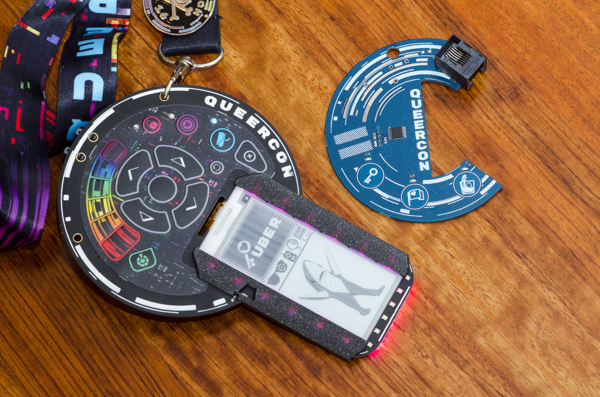

# 2019 Queercon 16 - DEF CON 27

After some of the issues from last year’s badge, mainly stemming from the sheer quantity of them and the complexity of the “game,” we decided we needed to keep it simple this year and really focus on the core of Queercon.

So, of course, we made like… eight badges.

## The Q and the C

One of the primary criticisms of last years badge was that we’d inadvertently created a two tier system. Main badge holders were the social elite, worthy of attention and praise. Access pass holders may have been entitled to entry into the same events and the same amount of free booze, but were not treated to the same level of social interaction. You see, if you had a main badge that means you were part of the game. If you had a pass… well you were just there.

We could have predicted this problem, but we didn’t.

We had to fix it, but how?

The non-electronic badges had to be part of the game.

How best to do that?

Well I guess we could… electrify them…

Leveraging offshore turnkey manufacturing and massive volume, we determined that we could make a badge that cost about the same as an access pass or a standard printed nametag.  So that is what we did…

## The Team

Evan Mackay – @ohhaiakio – Electrical design, implementation, and production

George Louthan – @duplico – Software engineering and prototype production

Tara S. – @skittishandbus – Graphic design, UI/UX, world building

Sam V. – @sidechannel_org – Puzzle and consulting

Andrew H. – Pillar design and manufacturing

Thomas Littlejohn – @CallMeCCLemon – Base station design and implementation

## Overall Concept

All badges exist in a cyberpunk-esque world wherein Queercon is facing great peril.  The pillars of Queercon, pride, party, and place, are in danger of collapsing.  The two badges, Q and C, must complete missions together and on their own in order to restore the pillars and “save” Queecon.

The pillar were literal inflatable LED pillars co-created by Andrew H. and Thomas L, and plugged into the badge’s RJ11 port to deposit resources specific to each pillar.  As the badges ran missions and farmed the various elements, they could be deposited into the pillars to make them more blinky.  When the pillars were at maximum, they became rainbow party lights.

## The "Q" Badge

The primary, most “queercon-eque,” badge for 2019 was what we refer to as the Q badge.  This badge was designed to be the full-fat Queercon experience and we really went all out on it.  The Q featured a 2.9″ e-ink screen, custom membrane keypad, bluetooth, and all the usual LEDs.

The real star of this show was the custom keypad we had made.  While I did the mechanical design, the wonderful Tara S. did the artwork to adorn it.  The keypad’s primary function was to allow users to choose an element that their badge was to work on and facilitate interaction with the screen.  Users could input their names, see who is around, choose and trade images, and create LED patterns.

Pairing between badges was accomplished via a 6P6C RJ11 port and a custom made 6P6C cable.  With a physical connection two badges could run communal missions, trade files and patters, and see eachother’s stats.  When connected to an unpowered C badge, the Q badge would provide power and allow the C badge to interact in almost all of the same ways as a Q.

Hardware this year was actually pretty simple.  The main processor was a TI CC2640R2FRGZR, a similar processor to the one used on the Cube badge from 2017.  The LED controller was the same beastly Holtek part from last year, being stretched a bit more this year driving 28 20mA RGB LEDs with a whopping 84 channels total.  Also, as is our standard, power was provided by two AA cells through our favorite boost regulator.  The 2.9″ eInk display utilized an on-board controller and regulators, somewhat simplifying the design.  While good looking, the display also supported partial refresh, enabling us to have an extremely responsive display while also getting all the energy efficiency of eInk.

## The "C" Badges

Learning our lesson from last year, this time we decided the “non-electronic” badges needed to be well… electronic.  After an initial feasibility analysis we determined we could create these “passes” for under the $3/unit target using a very limited number of components and off-shore manufacturing.  After the shape of the “Q” badge started to materialize as a Q, we knew we had to make the access pass look like a “C”.

While “main” or Q badges are meant to be somewhat scarce, the access or C badges are meant to be available to everyone as a way to get in to parties, support Queercon, and facilitate interaction with other badge holders.

The pass hardware was very simple.  It has the same 6P6C connector as the Q badge, an inexpensive TI MSP430, three captouch buttons, and three LEDs.  To reduce cost, the C-badges did not have a battery pack installed, though the pads were available for one, and instead were powered over the RJ11 connector whenever a Q badge plugged in.  Power up kits were available for purchase and included a battery pack and protective diode, such that the C-badge could be powered all the time, allowing it to “mine” for currency to support the pillars of Queercon.

Several special variation of the C badges were also created.  These were for sponsors, VIPs, speakers, and press to show their colors.  For the most part they were unpopulated as they were meant to show status alongside a Q-badge, but could be populated with parts that were available in the QC HHV.

## Production

Honestly, this might be the first year that I can say we had no major production mishaps.  Q badge production was done in the US on the east coast and was, overall, pretty painless.  C badges were produced overseas and had a 104% yield, which was impressive.

The only real problem we had was with the keypads.  While we were happy with the finished product, the fab was shipped an embossing tool that was out of spec, which introduced about a 3-week delay into production.  As a result, we didn’t see the final product until the production quantities of them arrived a week before the con.  This led us to missing a major design problem with the board, which I will cover next.

## Field Problems

Well it all can’t be good news, can it?  We did have… a lot of problems in the field this year…

### Keypad pressing

Let me tell you a story: When I first walked into the conference space on badge handout day, I was in high spirits.  Once again we get to show off our abilities and really show off.  So when the first badge I encountered was broken, you can imagine I was a little crushed.  It seemed as if their buttons weren’t working for some reason.

Then the next badge I encountered had the same problem.

And the next.

I won’t lie, I considered changing my flight, turning off my phone, and ghosting out of the whole experience.  THEY WORKED FINE AT HOME!

Over the course of the con we discovered that about 10 – 15% of the Q badges had a problem where the keypad couldn’t actuate the buttons.  After much troubleshooting, we discovered this was a perfect storm of design and manufacturing issues.  On some of the badges the soldermask, the insulation material that gives PCBs their color, was a little thicker than the others, which kept the contacts insulated from the keypad.  Unfortunately, I’d designed the shorting contacts to have soldermask between them, otherwise this wouldn’t have been a problem.  Additionally, we’d specified ENIG over HASL at the suggestion of our PCB vendor.  ENIG has the benefit of being hard wearing and very flat compared to HASL, but the downside of this was there was no variation to allow some of these defective badges to work anyway.

The solution was neither high tech nor particularly difficult.  Either you could scratch away the soldermask between the shoring pads, or flow solder onto the traces.  Unfortunately both options required removal of the keypad, which risked damage.

Over the course of the con we reworked 40 or 50 of these successfully, but it was a real ego blow.

### Software

I can’t speak to the actual cause of the problem, but for whatever reason the SPIFS on the badges would sometimes revert into read-only mode and essentially lock the badge into one saved state.  This meant any time you power cycled, the badge would revert to this saved state and like the past 5 minutes or 10 hours never happened.

Frustrating.

This did mean, however, that a certain number of people were able to game the system and fill up the pillars very quickly by depositing elements, power cycling, and repeating the process.  A very DEFCON way of finishing the game.

### Others

There were other little problems throughout, but overall we were really happy with how both badges, but especially the C badges, turned out.

## Overall

Overall we were really happy with how both badges, but especially the C badges, turned out.  The Q badges impressed visually and the C badges all but eliminated our “two tier” system of last year.

