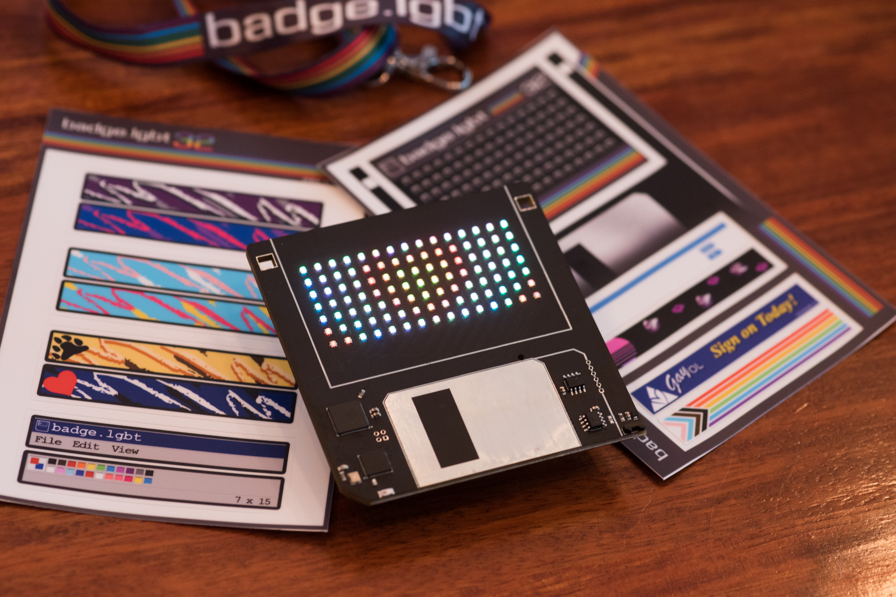
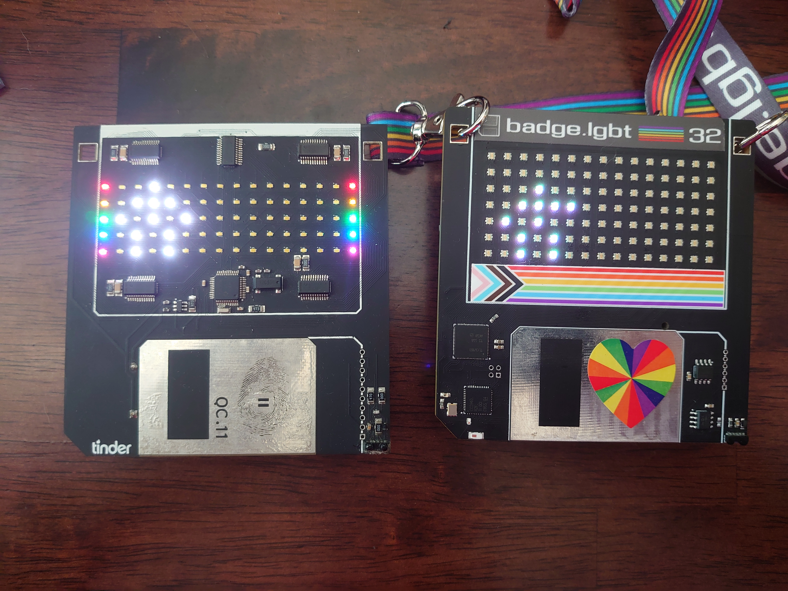
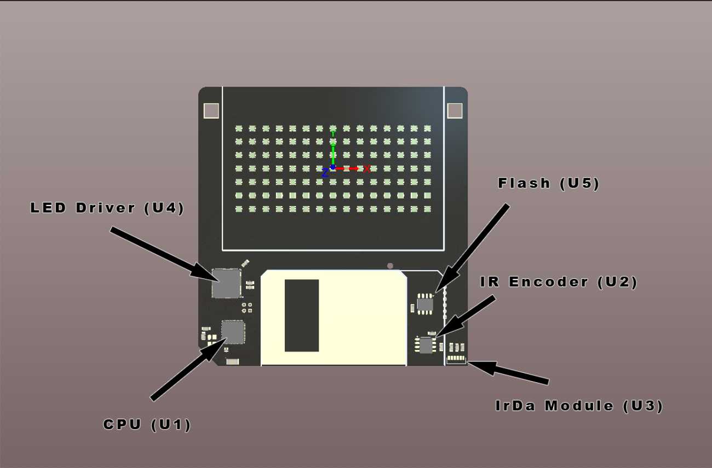
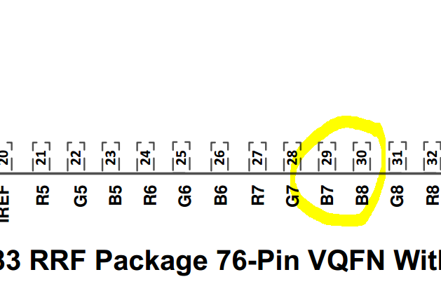
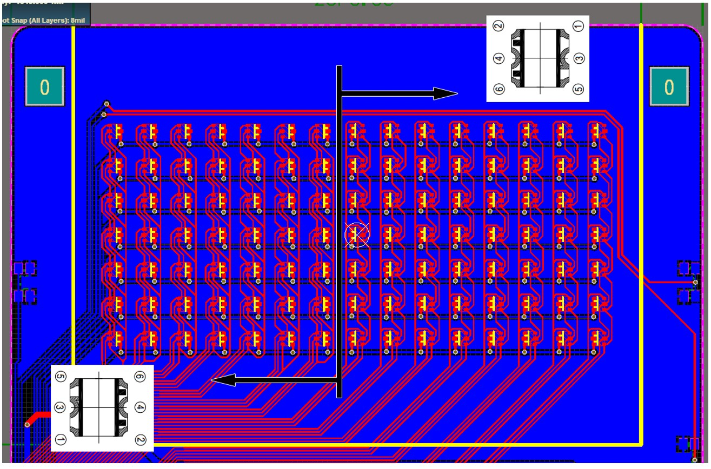
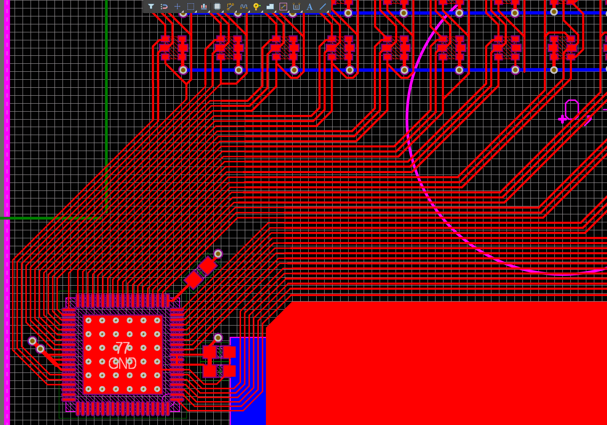
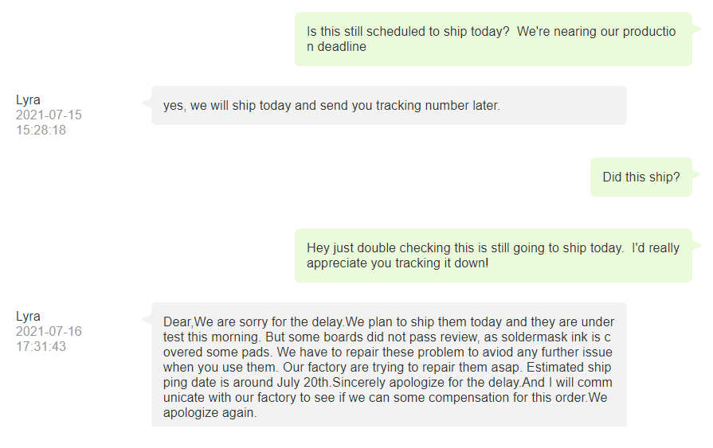
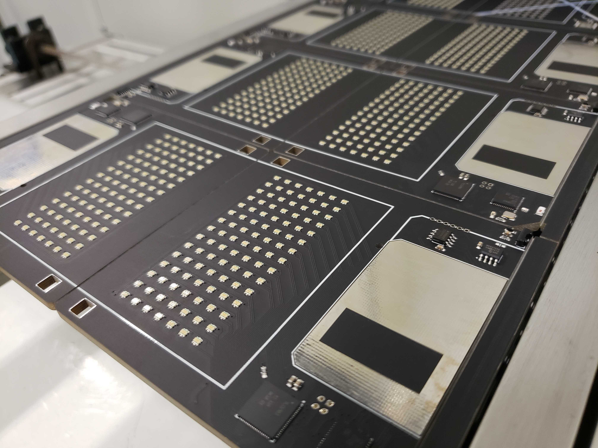

# 2021 BADGE.LGBT

## How did we get here?  Where am I?  _Who_ am I?

Well... I can answer two of those questions. For the latter try `whoami` and maybe that'll help. (I'll see myself out...) What were we talking about?  OH RIGHT!  Badges. I think we can all agree that 2020 was a hell of a year. On the long list of the many, many things we all lost, an in-person DEF CON was one of them. The Queercon badge team discussed doing a “safe mode” badge that could do all the usual Queercon things but from a distance. Ultimately, I decided that 2020 could be a year of rest. Too many years straight of doing badges and I needed a break. I didn’t want it to happen like this but I'll take the time off regardless.

When 2021 came around, the badge team was refreshed and ready for the challenge. But… what kind of badge should we make? An in-person badge? Remote? Hybrid? There were problems with all of these approaches, not the least of which being Queercon badges aren’t known for being particularly robust or error free, so anything that we were sending out to people either needed to be bulletproof or very simple, preferably both. Keeping in mind this was January 2021, late in the game to be planning a badge, and for most people the idea of getting vaccinated was a distant dream. Queercon itself was unsure of what a Queercon would look like… and continued to waffle (not that we blame them) until we were well past the design cut off for a badge.

Ok. So no badge for 2021?

WRONG.

Our software guy, George, insisted that if were were going to attend DEF CON (which at this point was both confirmed happening and we were both vaccinated) we needed to do a “small” “simple” badge that was maybe a throwback to one of our beloved earlier ones. Since it wasn’t officially a Queercon badge, we’d adopt new branding and control the sales and distribution ourselves.

Ok, sure. Why not? Simple, easy to produce, blinky, and very few features. If we can bang out a Halloween badge in a week, we can certainly do this…

Now how, exactly, we went from “simple” and “low component count” to “the most LEDs we have ever used” and “several fine pitch QFN parts” I will never know. Somehow “throwback” turned into “lets make an RGB version of the Disk badge from 2014” which turned into “oh but with more leds.”

After several iterations, the Badge.lgbt was born. An almost exact replica of a floppy disk, with a 7×15 RGB LED display, BLE, IrDa communications, and customizable stickers.

## Cast and Characters

Before we get too far into talking about the badge, lets talk about those who helped make it happen!

* Evan/ akio (@ohhaiakio) – I mainly do PCB design and manufacturing
* George (@duplico) – Responsible for the software and testing
* Bus (@Skittishandbus on X/Twitter) – All things graphical and branding
* Sam (@sidechannel_org on x/Twitter) – Puzzles and consulting

Those are just our primary roles, mind you. Everyone helped on everything and it was awesome. This is also the most recent iteration of the Queercon badge team and we just stole them for this project.

## Design

As stated above, the design is a call back to the 2014 Queercon badge, the 3.5″ floppy. The original Floppy had a 5×14 white LED matrix display with 1×5 columns of rainbow LEDs on either side, giving it a total display area of 5×16. Those LEDs were driven by five separate LED drivers positioned throughout the board. It also had an RF radio to detect other badges in the area and an IrDa transceiver to “pair” with other badges. Overall it was one of our most coveted designs, after perhaps 2016’s “Blooper” badge.

For the 2021 rendition, the only commonality between was the shape and the IrDa transceiver. Everything else on the 2021 disk was new, different, and more complicated.

The display on the badge.lgbt is a 7×15 RGB matrix with a total of 105 RGB LEDs in 315 individual elements. Controlling this monster of a display is a TI TLC6983RRFR, a brand new chip from TI designed to control jumbotron panels, not badges. The LED controller talks to the TI CC2640R2FRGZR, an Arm Cortex M3 BLE chip we’ve used on a number of Queercon badges in the past and is generally an OK processor, if very fussy. IrDa is transmitted via a Vishay TFBS4711-TR1, whose only real claim to fame is its ability to fall off of boards for like… no reason, via a encoder chip as the processor does not natively support IrDa.

The board’s battery supply was… well ‘jankity” might be the best word for it. Early in the design phase, back when we thought this was going to be a “simple” badge, we decided in order to reduce component count and minimize risk, we’d use a CR123 battery and no voltage regulator. We’d had success with this design in the past on the [Allhallowtide badge](https://github.com/ohhaiakio/ElectronicBadges/tree/main/2019%20Allhallowtide), so we figured it could scale. A CR123 is a lithium battery that outputs 3.0V directly and consistently, so adding a current limiting resistor and good brown-out detection you can get very good performance with little risk of explosion and fire. Some risk, but hey it wouldn’t be DEF CON without risk!

Other hardware of note are three right angle buttons for selecting patterns and controlling IR pairing. We also threw on a light sensor simply because we always do. Funny enough we didn’t end up using the light sensor, but may in the future.

Rather than spring for traditional PCB art, which likely would have been limited to silkscreen-only, we decided that in the spirit of floppy disks of the past, we’d make them have labels! The idea was you could apply any of the label designs to any part of the badge, allowing users to pick their clan, representation, design, etc. This, in a way, made each badge.lgbt somewhat unique and special and really added to the fun.

## Functionality

So what does it do? I mean… aside from being cute.

That was a big question and one we had to answer in a big hurry. The short answer is “make blinky lights” because what more do you want?

### circa 2021

At launch, the functionality of the badge was pretty simple. Badges start with a number of animations, which the user can choose which to display via one of the three buttons. One of the animations pre-loaded is semi-unique to the badge. Badges can then trade animations between them via IR until they “catch them all” in traditional badge fashion. Animations can either be downloaded from a badge or uploaded to the badge, so long as the IR can finish the transmission.

That’s it. That is the whole thing.

### Future Upgrades

We had grand plans to make a multi-year badge, but anyone who has been following our lack of updates on the website formally known as Twitter will see a suspicious lack thereof.  Unfortunately, while we'd _planned_ to do additional updates, life got in the way.  We'd assumed the worst of the pandemic chip shortages were behind us, however when 2022 came along, many of the parts we'd scrapped together for the 2021 design were no longer available (NLA) or end-of-life (EOL).  Faced with redesigning an already overly complicated, difficult to manufacture (we'll get to that) board, we opted to pass for 2022.  And 2023.  And 2024.  And so on.

Ideally, one day, maybe soon, we'll get another run produced and new firmware into the hands of the masses.

But I wouldn't count on it, sadly.

## Chalenges

Manufacturing. Manufacturing never changes.

Which is to say, every year _something_ comes up and this year was no different.

The biggest elephant in the room is the chip shortage. It is real and it cost us dearly. Our main strategy for dealing with it was to buy production components before we started making prototypes. This was risky to the wallet, but meant we didn’t risk going to production only to find the CPU had a 64 week lead time or something. (This did happen with the flash chip.) Luckily, this is not our first rodeo and we know how to put together a list of parts that will play nice and had no significant problems other than having to front the cost of production parts.

However, even being careful with part selection wasn’t a bulletproof way of avoid the chip shortage as some stuff just wasn’t available. The LED controller we’ve used for large numbers of RGB LEDs in the past, a Holtek part, was unavailable. Turns out a shockingly few number of matrix controllers of that ilk exist in the wild and even fewer were available. Eventually we located an expensive, fine pitch, brand new TI part that would do the job… only it was common cathode. All of our LEDs were 4-pin common anode. This meant selecting more expensive, but very cool, 6-pin LEDs where all the R, G, and B elements were individually routable. While we really like these LEDs (Everlight EAST1616RGBA8), at quantity they were still about $0.07 more than our usual LEDs from China. That which doesn’t sound like much until you scale it across 105 LEDs on 80 PCBs, plus spares and prototypes. In the end, we ended up paying about $1,000 more than expected between the LED controller and new LEDs.

This wasn’t the only problem with this LED controller either. While routing we noticed the consistent pinout went from RGB RGB to BGR BGR mid-package for no apparent reason. Ultimately this meant half the LEDs needed to be rotated 180 degrees in order for the badge to be routable in 2-layers. Sure, we could have increased to a 4-layer board and gone to via town, but I like the challenge of laying out an absurd number of traces in a very small area. 

Last, but certainly not least, of bullshit from the LED controller there was the issue of documentation and example code. As mentioned, this is a fairly new part and, frankly, the documentation is garbage. The words “barely functional” come to mind and George was totally left hung out to dry by TI on this one. To pay almost $6 for a chip that almost doesn’t even work was upsetting to say the least. Unfortunately this will do little to shake George’s unwavering fanboyism to TI, but it will certainly make me question ever using a “new” chip in their lineup again.

Unfortunately, the chip shortage wasn’t the only COVID beast we had to defeat. We also had massive issues with vendors. The first issue we encountered is no one seemed to want to mess with assembling our low-volume boards. We’ve done this before and knew we were going to pay a lot for a production run of 80. What we didn’t expect is to get assembly quotes that were more than what we paid for the entire production run of 2019 badges. One vendor who’d quoted both wanted around $8000 to assemble 650 Q badges and over $9000 for the 80 badge.lgbt. This was unexpected to say the least, and we grew increasingly concerned we were going to have to either scrap the project or hand-assemble the badges. Luckily, a vendor from the #badgelife community stepped in and gave us a very reasonable (but still more than we’d budgeted) quote and we decided to go for it. We were hoping to keep these less than $100 per unit, but ultimately we’d rather have them then not.

The next issue came from the board house, which we’ve used many time in the past with good success. Unfortunately when producing the panels, they dropped the ball.

Over and over and over.

Conversations with customer support went nowhere and eventaully I had to resort to a "name and shame" on Twitter to get the ball rolling after three weeks of little communication from the vendor.

Luckily the fab worked through the night and got them assembled at 5AM the Monday before DEF CON and in our hands that Tuesday. Huge shout out to PCBx for making it happen.

Sadly, our problems were not over, not surprisingly. The PCBs had been paneled in such a way the buttons, which overhang the board, couldn’t be soldered on. Crap. So in the end that meant me hand soldering 255 buttons into the wee hours of the night the day before we flew out. In the grand scheme of things, not a big deal.

As a sort of first for us, we also had issues with the non-electronic sides of things. Unclear on what actually happened, but the sicker company, Sticker Mule, really failed hard on cutting out the stickers. This meant hours and hours and hours cutting out the stickers by hand so they could be peeled and applied properly. It, frankly, sucked and we’ll be sure not to use them going forward.

## Yeild

We ordered 104 blanks on 13 panels looking for a total of 80 assembled PCBs. The assembler ended up completing 85 PCBs. Of those, we had one failed panel (8 PCBs) due to a registration error on the LEDs. We found an additional 5 PCBs with unknown issues before getting to DEF CON and an additional 8 PCBs with LED controller issues once we got on-site. Overall we sold or gave away 64 badges total.

Not our best year, but not our worst. Of the 13 that need rework, we’re hoping to recover most and make them available for sale to those who have expressed interest.

If I were to guess, I’d say the majority of our issues stemmed from poor soldermask quality on the fine pitch parts. This was a known possible issue, but as we didn’t have any problems with the hand-assembled prototypes, we thought we were in the clear.

## Wins

As a possible first this year, we had few known field failures. Part of this was (likely) due to the low number of boards in circulation and no centralized way to find us if something went wrong. I’d also like to think part of it is because people were taking care of their precious badges more so than usual this year.

A boy can dream, anyway.

Additionally the response from both within the community and from DEF CON as a whole was positive. This was our first year having to actually like… sell badges (Queercon usually takes care of that) and despite being one of the most expensive indie badges around, people were still very willing to pay. This felt like a wonderful validation of our work, as random people in the halls and elevators would stop me and ask how to get a badge.

The process of having to ask for money was mortifying, but on the bright side we were able to give away a fair number of the badges for free and still mostly cover costs. In the end, we didn’t quite break even, but we came way closer than we expected to.

## Conclusions

We were really happy with what we showed up with this year and are very much looking forward to making improvements for the next. In a perfect world, we’ll also be making a Queercon badge next year and are looking forward to both.

The challenges were many, but not unique to our process. Everyone had a hard time this year and we’re just happy we managed to produce something, even if it cost us many sleepless nights and new grey hairs.

## Photos

