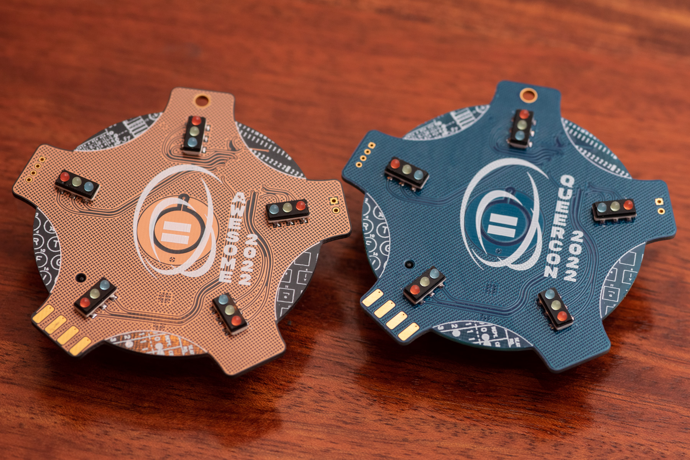
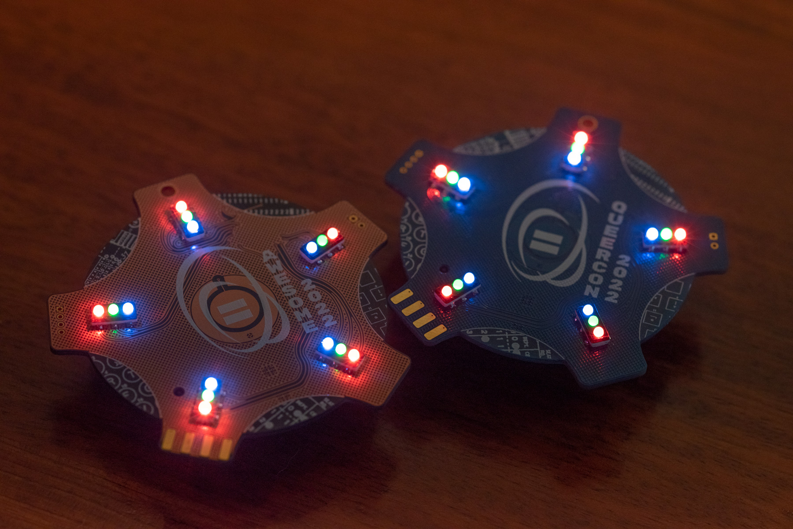
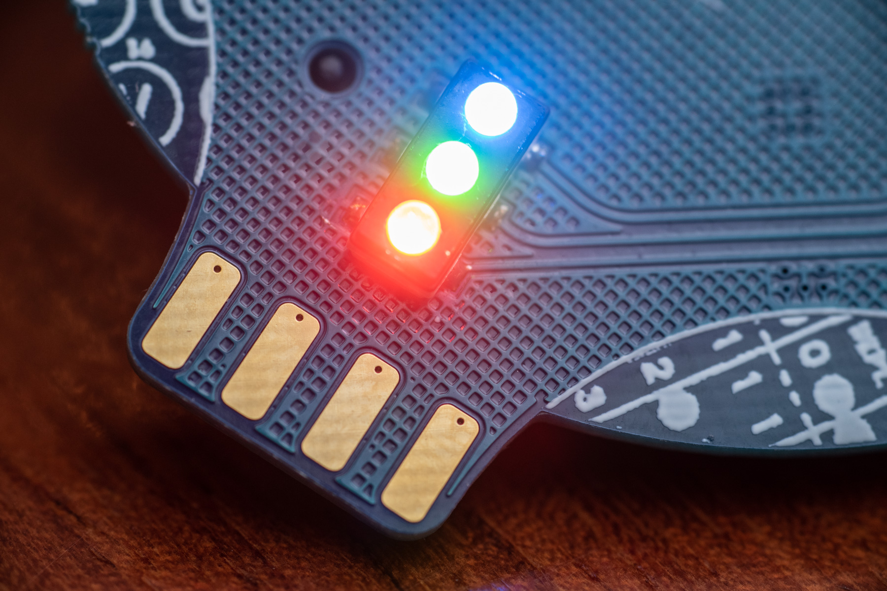
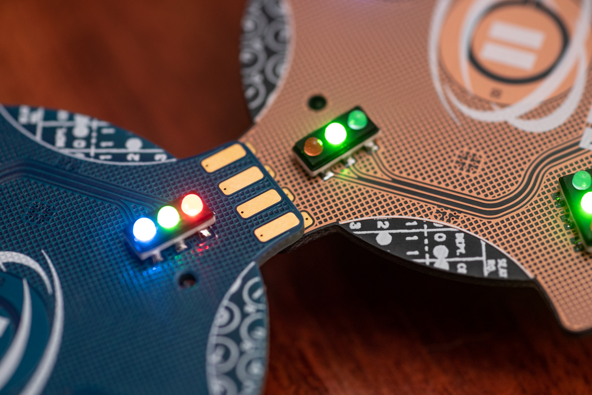
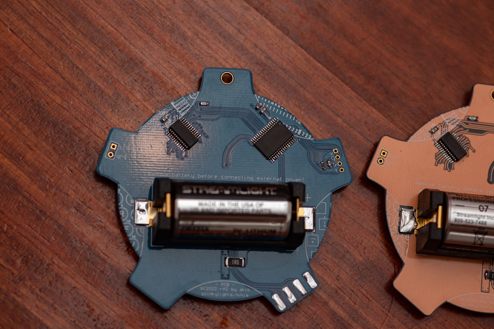
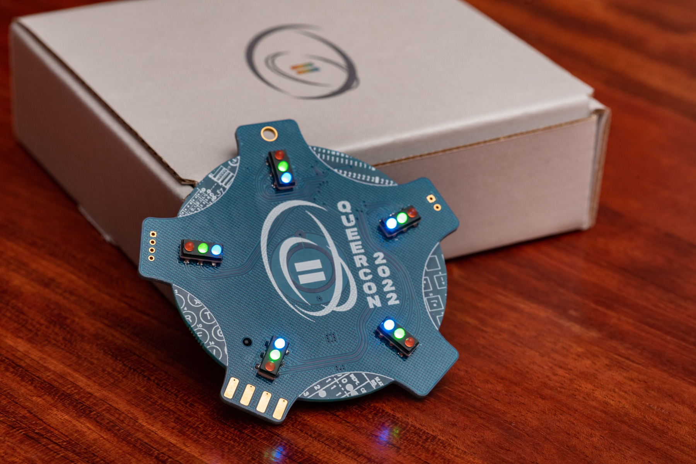

# 2022 Queercon 18 - DEF CON 30

At long last, the Queercon badge returns.

After significant organizational disruptions in 2019 after the sudden ousting of the long time leader of Queercon, the pandemic of 2020, and the pandemic chip shortage… to say a lot has happened would indeed be an understatement.

And yet, here we are again.

While the Badge.LGBT made for a good stopgap measure, there is nothing quite like the jank and charm of a real Queercon badge.

So, lets get acquainted with the new badge on the block!

## The badge with no name

Unusually, badges usually earn a name either in development or at the con.  “Companion Cube,” “Tamagotchi,” “Coke Can,” and “Blooper” to name a few.  This badge, however, never did.  The best we’ve really settled on is “the stop light badge” because of the distinct LEDs used.

Either way, the badge was made to be a simple, cheap, easy to manufacture, badge for the return of the Queercon badge.  No complicated radios, buttons, displays, or even a voltage regulator.  This was done partly for budget reasons, partly because of the ongoing chip shortage, and partly because the C-Badge of 2019 was still such a break out success.  Essentially the 2022 badge was a badge “minimum viable product” but still very successful.

## Functionality

The badge was equipped with five discrete element RGB LEDs, usually used in large displays like a “Jumbotron” these LEDs were used to depict a variety of stats and moods of the badge.  Badge-to-badge pairing was accomplished via exposed pads on the top and bottom of two arms of each badge.  By touching contacts, badges were able to exchange IDs and get credit for seeing an additional unique badge, gradually earning more animations and functionality as the con progressed.

Basically the pure essence of a Queercon badge.

## Problems

Thankfully, the simplicity of the badge ended up being a strength.  With so few components, very little ended up going wrong and we had no significant issues with at the con.

## Lack of write up

For reasons I don’t fully remember, I never ended up doing a write up of this badge at the time and here I am, trying to remember it over two years later and failing.  For that I apologize if anyone is reading this expecting my usual deep dive.

