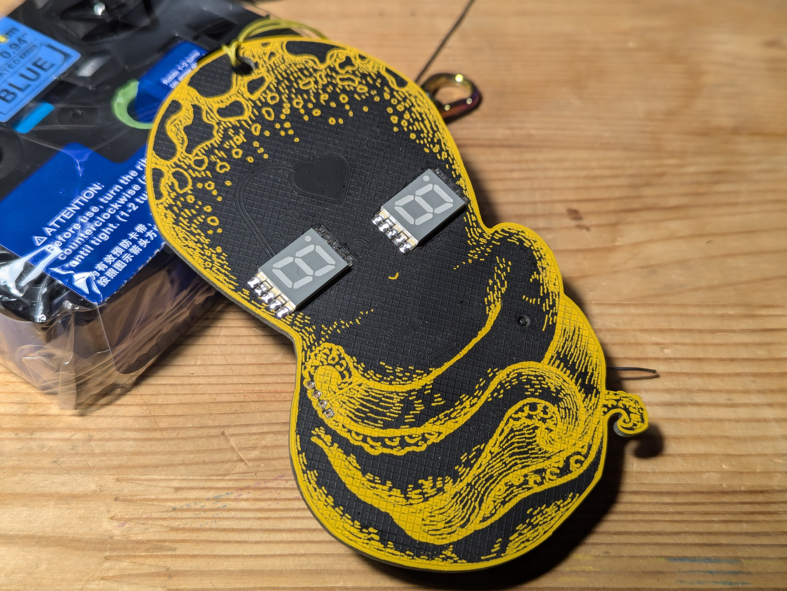
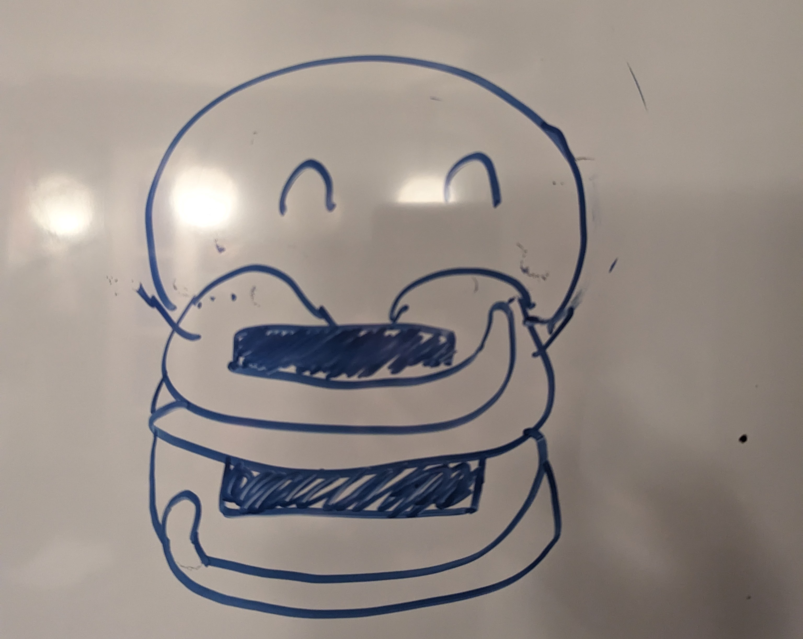
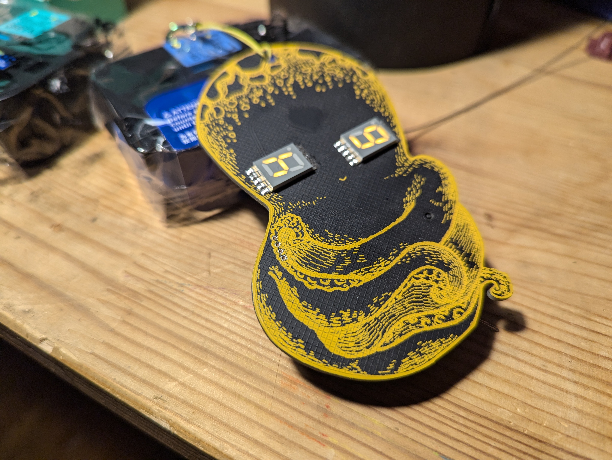
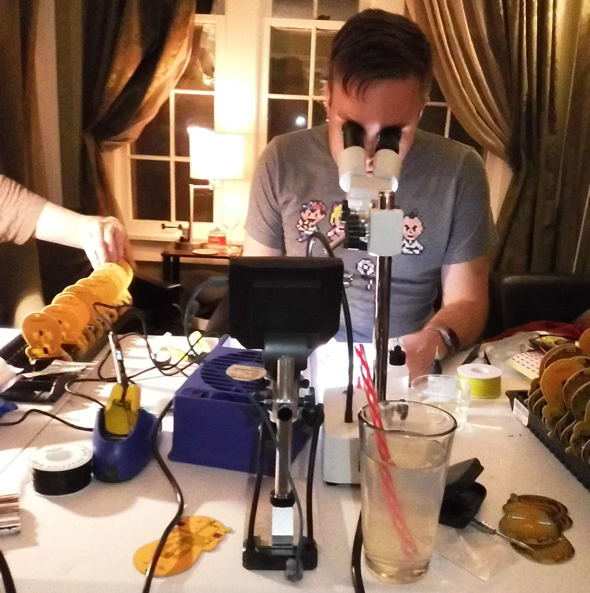

# 2023 Booper.Badge.LGBT - DEF CON 31

While 2022 saw the return of the official Queercon badge, 2023 saw the return of organizational issues that prevented the creation of the same.  And, as appears to be our way, when there is no Queercon badge a Badge.LGBT rises to meet demand.

The original concept of the 2023 badge was to be a simple, slide on, lanyard hanging badge with very little in the way of functionality.  With this design, we decided it would be cute to have a octopus or squid "hugging" the lanyard, sort of like this:

While I have been known to produce passable art in the past, I have never claimed to be an artist, as that whiteboard sketch should prove.  As the design evolved, we got an artist on Fiverr to produce a sketch of the hugging cephalopod and with it, the Booper was born!

The actual delivered artwork was slightly different, with the creature having a few additional tentacles.  However the net effect was to make it look very much like female genitalia, so with out revision budget gone, a quick photoshop removed that portion and resulted in a tighter, smaller design.

## So what does it do?

The Bopper is a pretty simple, Queercon style badge.  The two SMT 7-segement displays act as the Boopers main way of giving information to the user, showing the Booper's mood via various expressions.  The Booper is equipped with a ISM band radio that communicates with nearby Boopers, though due to a design error this occurs at woefully short range, and, in typical Queercon fashion, keeps track of the number of unique badges seen.  This number can be seen printed in the eyes on boot.

I apologize for the woeful photos, by the way.  I apparently neglected to take high quality photos at the time, an alarming trend, and don't have the time or energy to take them now.  Hopefully if you're reading this text, you're doing so in the Git history and I've since update the repo with better photos and text.

We can dream, at any rate.

The Booper has a heart shaped captouch button, from which half of its name is derived.  The DEF CON Furs badges are famous for being "boopable" wherein a captouch button can be pressed to elicit a reaction from the badge.  We though this was one of the best badge features we've seen in years and imitation is indeed the most sincere form of flattery.  Booping the Booper causes the eyes to go happy for a time, but not much else.

## Fabrication

Unlike every previous year, this year badge simplicity and budget constraints led us to manufacture the Booper in house.  Like... literally in my house.  We set up a reflow oven, stencil station, and rework station(s) in the living room, recruited friends to help, and paid them in pizza and beer to produce around 150 of these badges.  It was hot, time-consuming, exhausting work, but in the end it was done.

## Reception

Overall, the badge was well received by the community.  Simple, inexpensive, and cute, the 60 for sale sold out quickly and the remainder were all given away by Saturday morning.

Not perhaps our most memorable badge, but also not the worst by any stretch.
