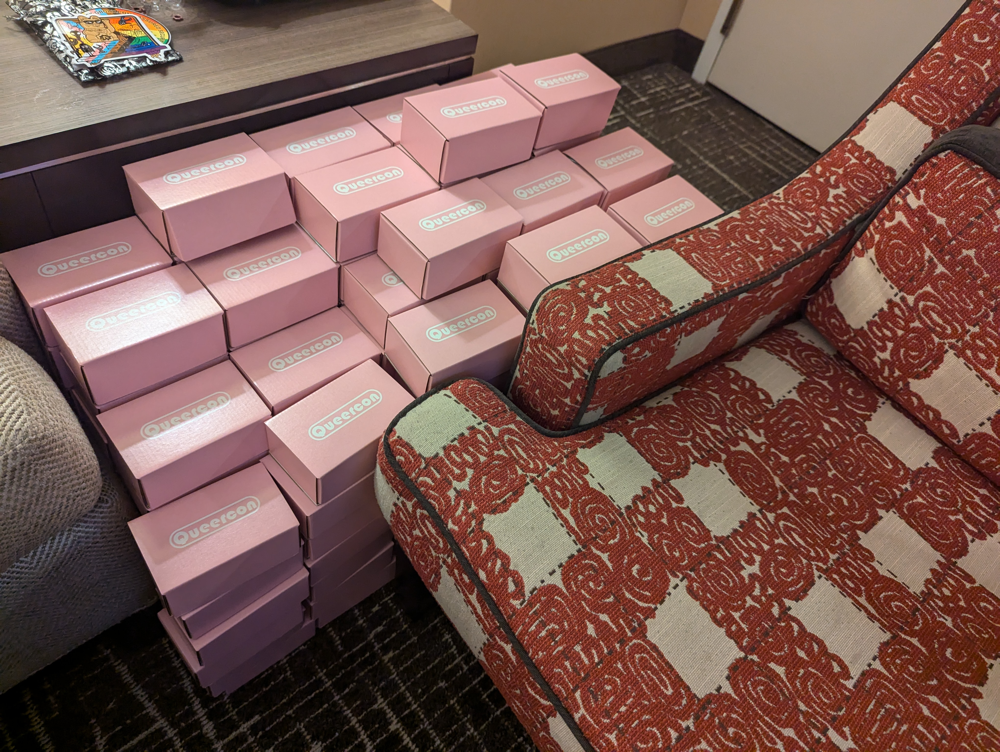
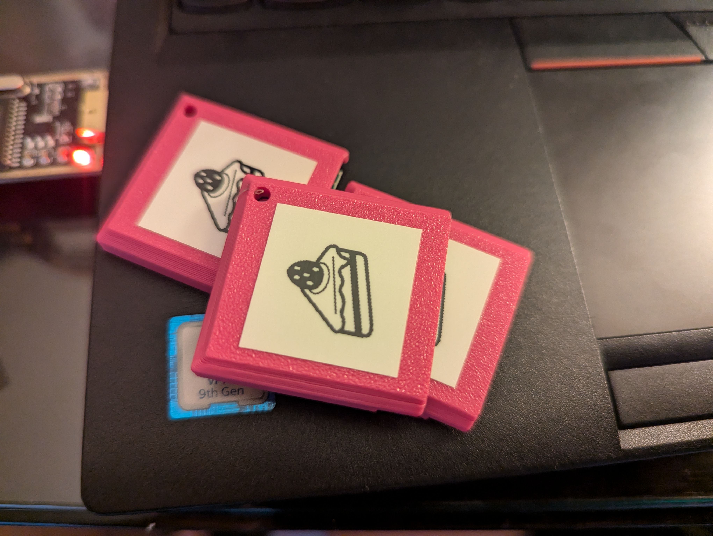
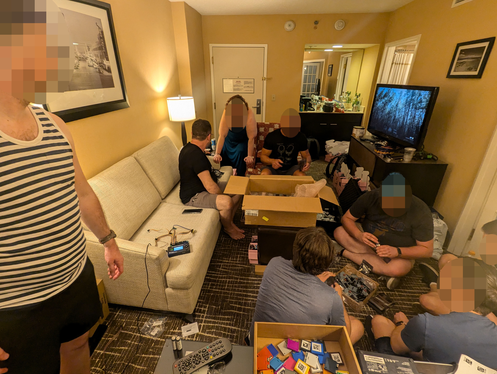

# 2024 Queercon 20 - DEF CON 32

> "The Queercon badge will never be a gameboy." -duplico

So we made a gameboy.

Sort of.

## Design

The 2024 Queercon badge was intended to create the look and feel of a retro handheld game console while promoting the social interaction and community building of a Queercon badge.  The resulting design features a 128x128 pixel 0.97" OLED screen, rotary encoder as the "d pad", A and B buttons, and 10 edge-light RGB LEDs.  In a Queercon first, the button covers and D-pad dial and cartridge cases were all 3-D printed in-house.

The interactivity comes from the game cartridges, which plug in to the back of the badge.  Unlike previous years, almost nothing is saved on the badge itself, instead the cartridges remember every badge they've seen and, depending on how the game was designed, will change and grow as they seem more badges.

This presents some unique challenges and opportunities.  On the one hand, it presents the possibility for theoretically infinite gameplay.  If an attendee "finishes" a game, they can get a new one and start over again, allowing for as much or as little social interaction as the owner wishes.  On the ohter hand, making and programming 1000 cartridges and 8+ games was a pain in the butt.

## Hardware

### Badge

The main badge is pretty standard Queercon fair.  A TI processor, LED controller, lots of LEDs, etc.  The main difference from our "typical" badge hardware is there is no radio, no mating connector, and no IR.  Instead, badge-to-badge interaction comes in the form of the game cartridges!  These cartridges plug into the back of the badge using two surface mount 20-pin PCIe connectors.  From there, the badge provides power and communicates with the hardware on the cartridge itself.  Speaking of...

### Game Cartridges

The game cartridges are about as simple as can be, having only some edge connectors, a SPI flash chip, and a little bit of supporting hardware.  This means, aside from being cute and functional, they were quite cheap to produce, which enabled us to make a lot of them.

I mean a lot a lot.

While there were only about 320 badges made, around 1000 cartridges were made.  The idea here was each badge holder could end up with around three unique cartridges to play with and some attendees could even write their own games!

That didn't _exactly_ happen, but we'll get to that!

The meat of the cartridges was the same 16 megabyte flash chip found on the badge, enabling rather complex or large "games" to be created.

If anyone is interested in developing more games for this, drop me a line and we can discuss!

## Software

I'll have links to the main repos below, but the summary is the software on the main badge actually didn't do a whole lot of the gameplay.  Each badge knew what its unique ID number was and a few other housekeeping things, and obviously dealt with controlling the LEDs and display, but the bulk of a player's progress and all of the game code was stored on the cartridge.

The game cartridge, as previously stated, only really had the "game code" on it, which the main badge would read, interpret, and save the progress to.  The "games" could be anything allowable in the game code infrastructure, which you can find in the main repo.  The main programmer, @duplico, spent a huge amount of time and effort developing a game language and emulator to make it easy to develop and create games.

Due to time constraints, the six games that could have come with a badge out of the box were all the same basic "TV" application, where the user unlocked new videos or animations the more badges that cartridge had been plugged in to.  This was very different from the usual Queercon paradigm, but once we'd explained it to enough people, they caught on and really leaned into it.

### [Main Repo](https://github.com/duplico/gamequeer)
### [Games Repo](https://github.com/duplico/gq-games) - Private at the time of writing

## Successes

Despite everything I'm about to say about problems we had in the research, development, and production of these badges, they really worked well!

People liked the 3D printed cartridges and the new gameplay elements they brought.  People really seemed to like the look, despite being one of many similarly themed badges all developed independently.  Additionally, despite a rocky start, production and assembly went really well and we had a surprisingly low failure rate.

## Lessons Learned

Well... I don't know if this was really a "lesson learned" so much as "lesson reiterated" but: badge design and prototyping is a long process and starting in May means you're really going to be cutting it close.

Like we did.

This is, by far, the closest we've ever come to not delivering on a badge due to just not having enough hours in the day.  The prototypes arrived late in the development cycle, the cartridges had to be remade several times due to my accidentally ordering them 1.6mm thick (the default for most PCB houses) instead of the correct 1.0mm.  Second prototypes only arrived a week before we had to go to production.  Several game-breaking, show-stopping bugs were discovered late in the development cycle, with the final code being committed and flashed in our hotel room in Las Vegas.  Cartridges were slow to program and the programmers delicate.

We just didn't leave ourselves enough time to do everything we wanted and that sucks.

## Not an end, but not not and end

For all the reasons above, while this will not be the last badge I make, I am firmly committed to taking 2025 badge season off to work on personal project and just not having to be doing badge crap for all of DEF CON and the months leading up to it.  Working on the Queercon and Badge.LGBT hardware has been an amazing experience, but having been doing it since 2013 the time has come to take a break.

###### Note: More photos coming eventually
